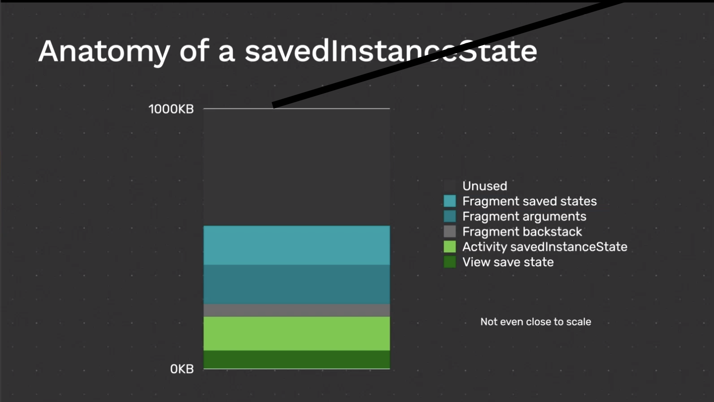
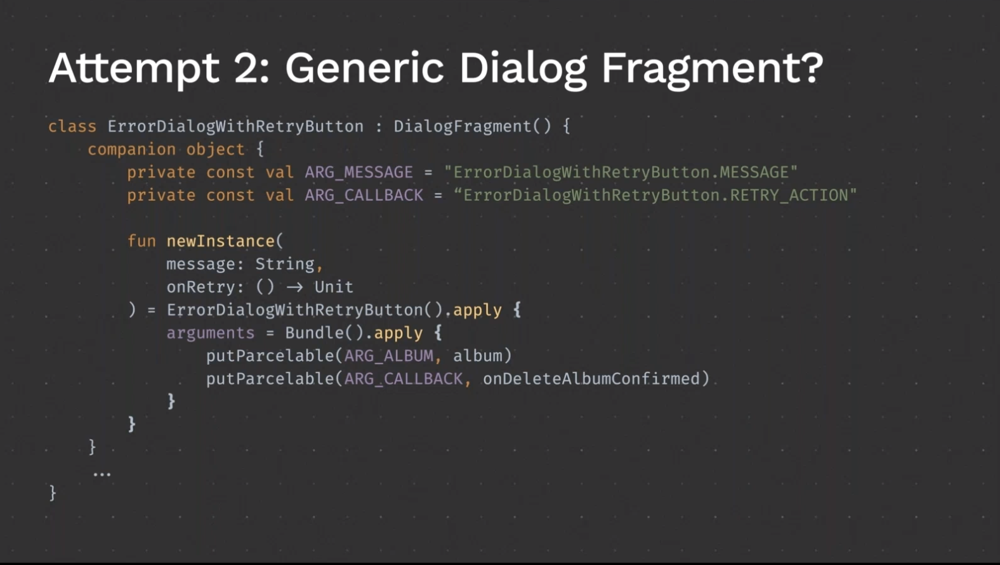

Droid Pirate에 실린 개발자가 라이프사이클과 관련해서 겪는 실수 동영상을 보고 나름 정리해보았다. 놓치고 있던 부분들이 많은것 같아 상당히 유익한 동영상이었다.

## False Assumption #3

Using configCahnges is a cheap way to correctly handle configuration change

## False Assumption #4

it it possible to reliably prevent your activity from restarting

엑티비티가 재시작하는 이유 

- Configuration change
  - Orientaton
  - Window Size(multi-Window,resizable ChromeOs window, etc..)
  - Night mode
  - Language
  - Display/Font acling factor
  - MNC/MCC(The user changes SIM cards)
- Process eviction
  - Low memory
  - Permission revoked
- Developer called restart()

## False Assumption #6

If i check for a permission before launching an activity that needs it,the new Activity doesn't need permission Check

## False Assumption #7

My initialization logic will always be executed at least once before my UI is shown.

```kotlin
class SplashActivity : AppCompatActiviy(){
  override fun onCreate(ssavedInstanceState : Bundle?){
    super.onCreate(savedIntacneState)
    // some required initialization work
    
    initializeReallyImportanteAppData()
    startActivity(MainActivity.newIntent(this))
    finish()
  }
}
```

- SplahActivity 에서 앱을 실행하기 전에 필요한 작업을 했으니 다음 MainActivity로 넘어가도 되겠지?
- 문제는 Process Death 에서 발생 새로 생성된 MainActivity에는 SplashActivity가 없었다 illegalStateExcetion,NullPointExcetion .etc.. 발생 가능

## False Assumption #8 

I can safely pass Fragment arguments as properties or with constructors

## False Assumption #9

The only limitation of Fragment argmuents and saved state Bundles is the type of data.

- 정보 전달시 정말 매우 나쁜 방법 : Json To String
- Budle & Intent size는 이 론 상 1MB로 제한되어있음 실전에선 그보다 적음
- 50KB 아래의 데이터를 실전에서 쓰길 권장
- 복잡한 오브젝트는 피하고 
- NO JSON!



어떤 에러를 보여주고 싶을 때 

1. AlertDialog : rotate,configuration chagne 등으로인해 엑티비티 재시작 후엔 사라진다. 나쁜 방법

2. Generic dialog fragment

   


```kotlin
putParcelabe(ARG_CALLBACK,onDeleteAlbmumConfirmed)
```

-> Navigation Library를 사용중이라면 이줄에서 두가지 에러를 보게될것

```kotlin
Execution failed for task 'app:generateSafeArgsDebug' > Can't escape identifier '() -> Unit' because it contain illegal characters: >

UnsupportedOperationException : ErrorCallback must implement Parceralbe or Serializable or must be on Enum.
```

## False Assumption #10

There is a safe way of passing Lambda epressions as Fragment arguments

## False Assumption #11

I can perform Fragment transcations and navigation events whenever i want

Embrace Activity & Fragment recreations

- 너의 엑티비티는 거의 언제든지 재생성 될수 있따
- Use ViewModel + SavedState or savedInstanceState bundles 
- android:configChanges  설정을 피해라 (SurfaceView, Window 뷰가 아니라면)

Tolerate process eviction

- 중요한 초기화 작업을 스플래시가아니라 Application에서 작업하라
- 너의 static variables or singletons가 주어진 상태라고 가정하지 마라
- Prefer lazy loading instead of prefetching on startup


—영상 링크 — 

https://www.droidcon.com/media-detail?video=443146897