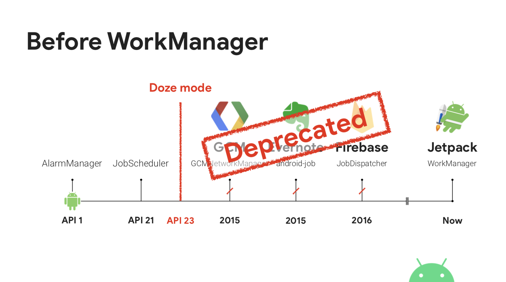

## WorkManager

- 왜 Jetpack WorkManager 을 알아야하는가 



- 그전의 Firebase, GCM 같은 방법들이 다 Deprecated 되기 때문

WorkManager API 의 주요 클래스는 WorkManager, Worker, WorkRequest, WorkState 입니다.

- WorkManager :  처리해야 하는 작업을 자신의 큐에 넣고 관리합니다.싱글톤 인스턴트로 사용 하기 위해서 내부에 WorkManager 객체를 반환하는 getInstance() 함수가 있습니다. 이 메서드를 통해서 WorkManager 의 인스턴트를 받아 사용합니다.

- Worker : 추상 클래스 입니다. 처리해야 하는 백그라운드 작업의 처리 코드를 이 클래스를 상속받아 doWork() 메서드를 오버라이드 하여 작성하게 됩니다.

  doWork() 메서드는 작업을 완료하고 결과에 따라 Worker 클래스 내에 정의된 enum 인 Result 의 값중 하나를 리턴해야 합니다. SUCCESS, FAILURE, RETRY 의 3개 값이 있으며 리턴되는 값에 따라 WorkerManager 는 해당 작업을 마무리 할것인지 재시도 할것인지, 실패로 정의하고 중단할것인지 이후 동작을 결정하게 됩니다.

- WorkRequest : WorkManager 를 통해 실제 요청하게될 개별 작업입니다. WorkRequest 는 처리해야 할 작업인 Worker 와 작업 반복 여부 및 작업 실행 조건, 제약 사항 등 이 작업을 어떻게 처리할 것인지에 대한 정보가 담겨 있습니다. WorkRequest 는 반복 여부에 따라 다음의 두가지로 나뉘어 집니다.

  - OneTimeWorkRequest : 반복하지 않을 작업, 즉 한번만 실행할 작업의 요청을 나타내는 클래스 입니다.

  - PeriodicWorkRequest : 여러번 실행할 작업의 요청을 나타내는 클래스 입니다.

    WorkState : WorkRequest 의 id 와, 해당 WorkRequest 의 현재 상태를 담는 클래스입니다. 개발자는 WorkState 의 상태 정보를 이용해서 자신이 요청한 작업의 현재 상태를 파악할수 있습니다. WorkState 는 ENQUEUED, RUNNING, SUCCEEDED, FAILED, BLOCKED, CANCELLED 의 6개의 상태를 가집니다.

1. ## 단순 작업

   ```kotlin
   import androidx.work.Worker
   
   class SimpleWorker : Worker() {
       override fun doWork(): Result {
           // 이곳에 처리해야할 작업 코드를 추가합니다
   
           return Result.SUCCESS
       }
   
   }
   ```

   ```kotlin
   private fun doWorkOneTime() {
           val workRequest = OneTimeWorkRequestBuilder<SimpleWorker>().build()
   
           val workManager = WorkManager.getInstance()
           
           workManager?.enqueue(workRequest)
   }
   
   ```

   1. Worker 클래스를 상속받은 클래스를 만들고 doWork() 메서드를 오버라이드 합니다. 처리 결과에 따른 Result 값을 리턴해야 합니다.
   2. OneTimeWorkRequestBuilder 를 이용해서 OneTimeWorkRequest 객체를 생성합니다. 이제 SimpleWorker 는 한번 실행 될수 있는 작업이 되었습니다.
   3. WorkManager 클래스의 getInstance() 메서드로 싱글턴 객체를 받아서 WorkManager 의 작업 큐에 OneTimeWorkRequest 객체를 추가 하면 끝입니다.

2. ## 제약 조건 걸기

   ```kotlin
   private fun doWorkWithConstraints() {
           // 네트워크 연결 상태 와 충전 중 인 상태를 제약조건으로 추가 한다
           val constraints = Constraints.Builder()
                   .setRequiredNetworkType(NetworkType.CONNECTED)
                   .setRequiresCharging(true)
                   .build()
   
           // 제약 조건과 함께 작업 생성
           val requestConstraint  = OneTimeWorkRequestBuilder<SimpleWorker>()
                   .setConstraints(constraints)
                   .build()
   
           val workManager = WorkManager.getInstance()
   
           workManager?.enqueue(requestConstraint)
    }
   ```

3. ## 사용법3. 연결된 작업 (Chaining work)

```kotlin
private fun doWorkChaining() {
        val compressWork = OneTimeWorkRequestBuilder<CompressWorker>().build()
        val uploadWork = OneTimeWorkRequestBuilder<UploadWorker>().build()

        WorkManager.getInstance()?.apply {
            beginWith(compressWork).then(uploadWork).enqueue()
        }
}
    
```


