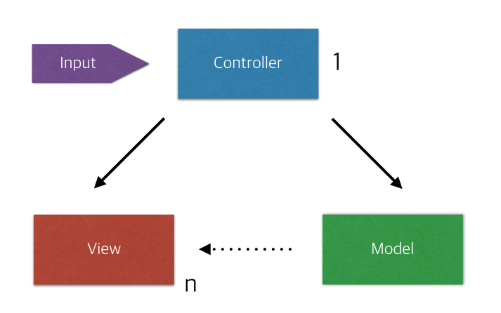

쾌적하고 좋은 환경에서 개발을 하기위한 프레임 워크 패턴들

대표적인 케이스로 MVC,MVP,MVVM 이 있다.

------

### MVC(Model + View + Controller)

MVC 는 Model,View,Controller 세가지 요소로 구성 되어 있다.

- Model : 프로그램에서 사용되는 실제 데이터 및 데이터 조작 로직을 처리하는 부분

- View : 사용자 내부에게 보여지는 UI부문 

  웹이라면 웹페이지,모바일 어플의 화면이 View에 해당한다고 보시면 됩니다.

- Controller : 사용자의 입력을 받고 처리하는 부분

1. Controller로 사용자 입력이 들어옵니다.
2. Controller는 Model을 데이터 업데이트 및 불러오고
3. Model은 해당 데이터를 보여줄 View를 선택해서 화면에 보여주게 됩니다.

**But** MVC의 단점. View와 Model이 서로 의존적이라는 점!

서로의 의존성을 최대한 줄이기 위해 나온것이 MVP 패턴

------

### MVP (Model + View + Presenter)

MVP는 Model과 View가 같지만. Controller 대신 Presenter가 존재합니다.

- Presenter : View에서 요청한 정보를 Model로부터 가공해서 View로 전달하는 부분

Model과 View는 MVC와 동일하지만 사용자 입력을 View에서 받습니다.

그리고 Model과 View는 각각 Presenter와 상호작용을 하게됩니다.

1. View로 사용자 입력 받음
2. View는 Presenter에 작업 요청
3. Presenter에서 필요한 데이터를 Model에 요청합니다.
4. Model은 Presenter에 필요한 데이터를 응답합니다.
5. Presenter는 View에 데이터를 응답합니다.
6. View는 Presenter로부터 받은 데이터로 화면에 보여주게 됩니다.

**But** View와 Model은 의존성이 없는 대신 View와 Presenter가 1:1로 강한 의존성을 지니게됩니다.

그래서 등장한 프레임워크가 MVVM입니다.

------

MVVM(Model + View + ViewModel)

MVVM은 WPF나 SilverLight에서 많이 사용하는 프레임워크 패턴입니다.

역시 Model과 View는 다른 프레임워크 패턴과 같습니다.

하지만 이번에는 Presenter 대신 ViewModel이 존재합니다.

- ViewModel : View를 표현하기위해 만들어진 View를 위한 Model

MVVM은 두가지 디자인 패턴을 사용합니다. 바로 Command패턴과 Data Binding

이 두가지 패턴으로 인해 View와 ViewModel은 의존성이 완전히 사라지게 됩니다.

MVP와 마찬가지로 View에서 입력이 들어오고 입력이 들어오면 Command 패턴을 통해 ViewModel에 명령을 내리고 Data Binding으로 인해 ViewModel의 값이 변화하면 바로 View의 정보가 바뀝니다.

1. View에 입력이 들어오면 Command 패턴으로 ViewModel에 명령을 합니다.
2. ViewModel은 필요한 데이터를 Model에 요청 합니다.
3. Model은 ViewModel에 필요한 데이터를 응답 합니다.
4. ViewModel은 응답받은 데이터를 가공해서 저장합니다.
5. View는 ViewModel과의 Data Binding으로 인해 자동 갱신 됩니다.

------

다음에는 안드로이드 내에서 실제 어떻게 패턴들이 사용되는지에 대해 알아볼것