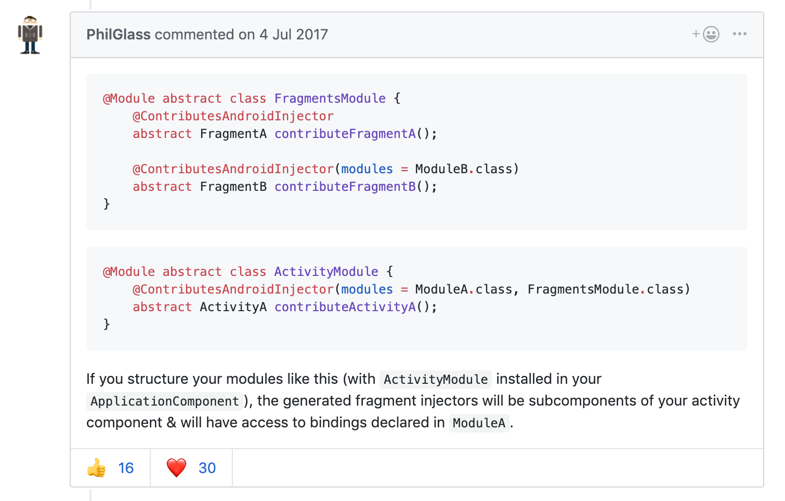

#### GitHubBrowser 의문점

1. ## 어디에 쓰이는 코드인고?

```kotlin
@Suppress("unused")
@Module
abstract class FragmentBuildersModule {
    @ContributesAndroidInjector
    abstract fun contributeRepoFragment(): RepoFragment

    @ContributesAndroidInjector
    abstract fun contributeUserFragment(): UserFragment

    @ContributesAndroidInjector
    abstract fun contributeSearchFragment(): SearchFragment
}

```

- 시작 

- https://black-jin0427.tistory.com/168

  원래대로라면 Component에 주입할 곳을 추가해준다.

  - ```java
    @Component(modules = BurgerModule.class)
    public interface BurgerComponent {
    
        void inject(MainActivity activity);
    
        //새로 주입할 곳(DetailActivity)을 추가해 주었습니다.
        void inject(DetailActivity activity);
    
    }
    ```

    Activity에 DaggerComponent를 생성

    ```java
    public class DetailActivity extends AppCompatActivity {
    
        @Inject
        Burger burger;
    
        @Override
        protected void onCreate(@Nullable Bundle savedInstanceState) {
            super.onCreate(savedInstanceState);
            setContentView(R.layout.activity_main);
            setTitle("DetailActivity");
    
            DaggerBurgerComponent.builder()
                    .build().inject(this);
            
        }
    }
    ```

    

  - Activity를 만들 때마다 Component를 build()하고 inject() 해주는 방식은  여러모로 귀찮다. 따라서 간단히 해줄 수 있는 방법이 바로 ContributesAndroidInjector

**ContributesAndroidInjector?**

- ```
  public @interface ContributesAndroidInjector
  ```

  Generates an [`AndroidInjector`](https://google.github.io/dagger/api/2.12/dagger/android/AndroidInjector.html)[`Subcomponent`](https://google.github.io/dagger/api/2.12/dagger/Subcomponent.html)[`Module`](https://google.github.io/dagger/api/2.12/dagger/Module.html)

  This annotation must be applied to an abstract method in a [`Module`](https://google.github.io/dagger/api/2.12/dagger/Module.html) that returns a concrete Android framework type (e.g. `FooActivity`, `BarFragment`, `MyService`, etc). The method should have no parameters.

  For more information, see [the docs](https://google.github.io/dagger/android)

- Activity Binder을 예제로 간단하게 살펴보자

1. ActivityBinder

```java
@Module
abstract public class ActivityBinder {

    @ContributesAndroidInjector
    abstract MainActivity bindMainActivity();

    @ContributesAndroidInjector
    abstract DetailActivity bindDetailActivity();
}
```

 우리는 MainActivity, DetailActivity 에 했던 작업들을 전부 모듈을 사용해 처리할려고 합니다. 그러기 위해서 모듈에 MainActivity와 DetailActivity 를 ContributesAndroidInjector 어노테이션을 사용하여 제공


2. AppCompoent

   Component는 모듈에서 제공받은 객체를 조합하여 어디에 주입할지 정하는 역활

```java
@Singleton
@Component(
        modules = {
                BurgerModule.class,
                ActivityBinder.class,
                AndroidSupportInjectionModule.class
        }
)
/*AndroidSupportInjectionModule -> 대거의 안드로이드 지원모듈 ㅇAndroidInjector<MyApplication>을 상속함으로써 MyApplication 으로 주입합니다.*/
public interface AppComponent extends AndroidInjector<MyApplication> {

}
```

3. DaagerAppCompactActivity

   ```java
   public class MainActivity extends DaggerAppCompatActivity {
   
       @Inject
       Burger burger;
   
       @Override
       protected void onCreate(@Nullable Bundle savedInstanceState) {
           super.onCreate(savedInstanceState);
           setContentView(R.layout.activity_main);
           setTitle("MainActivity");
   
           // DaggerBurgerComponent 함수는 필요 없습니다.
           /* DaggerBurgerComponent.builder().build()
                   .inject(this);*/
   
           Log.d("MyTag","MainActivity burger bun : " 
                   + burger.bun.getBun() + " , patty : " + burger.patty.getPatty());
   
       }
   }
   ```

   MainActivity, DetailActivity 를 AppCompatActicity 가 아닌 DaggerAppCompatActivity 로 상속해 주면 BurgerComponet 사용 없이 객체를 주입할 수 있게 됩니다.

### 아하 간단히 쓰려고 저렇게 썻구나 그런데..


```kotlin
class SearchFragment : Fragment(),Injectable{
  ...
  ...
}
```

# 애는 뭐 딱히 없는데?

https://github.com/google/dagger/issues/796



### 라고 한다. Thx PhilGlass!!

찾아보니 역시 있다.

```kotlin
@Suppress("unused")
@Module
abstract class MainActivityModule {
    @ContributesAndroidInjector(modules = [FragmentBuildersModule::class])
    abstract fun contributeMainActivity(): MainActivity
}

```

2. ## ViewModelModule

```kotlin
@Suppress("unused")
@Module
abstract class ViewModelModule {
    @Binds
    @IntoMap
    @ViewModelKey(UserViewModel::class)
    abstract fun bindUserViewModel(userViewModel: UserViewModel): ViewModel

    @Binds
    @IntoMap
    @ViewModelKey(SearchViewModel::class)
    abstract fun bindSearchViewModel(searchViewModel: SearchViewModel): ViewModel

    @Binds
    @IntoMap
    @ViewModelKey(RepoViewModel::class)
    abstract fun bindRepoViewModel(repoViewModel: RepoViewModel): ViewModel

    @Binds
    abstract fun bindViewModelFactory(factory: GithubViewModelFactory): ViewModelProvider.Factory
}

```

- 열심히 aac MVVM에 관한 글을 읽으며 오던중 Dagger개념인 Module이 ViewModel에 들어가있는걸 확인했다.

  ## .. 왜 들어가있는거죠? 

  바로 검색

- 일반적인 ViewModel을 봐보자

```java
public class MyViewModel extends ViewModel {
 
    private List<MyData> mData = new ArrayList<>();
 
    public List<MyData> getData() {
        return mData;
    }
 
    public void setData(List<MyData> data) {
        mData = data;
    }
}
```

- 이걸 Activity나 Fragment에서 쓰려면 그냥 선언만 해주면 된다. 

```java
protected void onCreate(Bundle savedInstanceState) {
    super.onCreate(savedInstanceState);
    mMyViewModel = ViewModelProviders.of(this).get(MyViewModel.class);
}
```

- 어떠한 외부적인 의존성도 가지지않기 때문에 Dagger가 들어갈 자리가 없을 뿐더라 가장 심플한 뷰모델 사용 케이스이다.
- If all you want to achieve is to keep some data on configuration changes, this approach will suffice and there is really no need to complicate things.
- 데이터의 상태변화를 기억해야할 필요가 있다면 외부 의존성(External Dependencies)가 필요해진다.

잠시 옆으로 새자면 그동안 LiveData 예제나 다른 글들을 보면서 궁금했던것은 

ViewModelProviders.Factory가 들어갈 때도 있고 안들어갈 때도 있어서 왜 쓰냐는 것이었다.

------

ViewModel 클래스는 자체적으로 어떤 기능도 포함하고 있지 않기 때문에 일반적인 객체처럼 new 키워드로(자바일 경우) 객체를 생성하는 것은 아무런 의미가 없습니다. 반드시 ViewModelProvider를 통해서 객체를 생성해야지만 HolderFramgnt에 의해 ViewModel이 관리되며, 기기의 구성 변경에서 살아남을 수 있습니다.

이런한 이유로 커스텀 생성자를 갖는 ViewModel은 ViewModelProvider에게 해당 객체를 생성할 수 있는 방법을 제공해야 합니다. 이런 경우를 다루기 위해 ViewModel 라이브러리는 개발자에게 ViewModelProvider.Factory 인터페이스를 사용하도록 강제하고 있습니다.

------

강제하는데 Factory를 쓰고 안쓰는 코드가 있다. 그리고 google aac 예제는 ViewModelFactory를 di 폴더로 빼놓아서 확장성 있게 사용한다. 

- ViewModelProviders 내부 코드

```java
// Activity에서 초기화
public static ViewModelProvider of(@NonNull FragmentActivity activity) {
		return of(activity, null);
}

// Activity에서 초기화
public static ViewModelProvider of(@NonNull FragmentActivity activity,
				@Nullable Factory factory) {
		Application application = checkApplication(activity);
		if (factory == null) {
				factory = ViewModelProvider.AndroidViewModelFactory.getInstance(application);
		}
		return new ViewModelProvider(activity.getViewModelStore(), factory);
}
```

`factory`가 없을 경우 내부의 `ViewModelProvider`.`AndroidViewModelFactory`.`getInstance()`를 호출하는 코드가 포함되어있는데, 아래의 `AndroidViewModelFactory` 코드를 확인할 수 있다. 그리고 밑에 **create**코드를 보면

```java
public static class AndroidViewModelFactory extends ViewModelProvider.NewInstanceFactory {

	private static AndroidViewModelFactory sInstance;

	@NonNull
	public static AndroidViewModelFactory getInstance(
			@NonNull Application application) {
		if (sInstance == null) {
			sInstance = new AndroidViewModelFactory(application);
		}
		return sInstance;
	}

	private Application mApplication;

	/**
	 * Creates a {@code AndroidViewModelFactory}
	 *
	 * @param application an application to pass in {@link AndroidViewModel}
	 */
	public AndroidViewModelFactory(@NonNull Application application) {
		mApplication = application;
	}

	@NonNull
	@Override
	public <T extends ViewModel> T create(
			@NonNull Class<T> modelClass) {
		if (AndroidViewModel.class.isAssignableFrom(modelClass)) {
			//noinspection TryWithIdenticalCatches
			try {
				return modelClass.getConstructor(Application.class).newInstance(mApplication);
			} catch (NoSuchMethodException e) {
				throw new RuntimeException("Cannot create an instance of " + modelClass, e);
			} catch (IllegalAccessException e) {
				throw new RuntimeException("Cannot create an instance of " + modelClass, e);
			} catch (InstantiationException e) {
				throw new RuntimeException("Cannot create an instance of " + modelClass, e);
			} catch (InvocationTargetException e) {
				throw new RuntimeException("Cannot create an instance of " + modelClass, e);
			}
		}
		return super.create(modelClass);
	}
}
```

- create 에서는 넘어온 Class<T>의 객체가 AndroidViewModel인지 체크하고 다음 Application.class가 생성자에 포함되어 있는 객체를 생성하고, 그렇지 않으면 아래의 기본 NewInstanceFactory의 create()를 호출하여 생성자에 아무것도 없는 객체를 생성하게 된다.

```java
public static class NewInstanceFactory implements Factory {

	@SuppressWarnings("ClassNewInstance")
	@NonNull
	@Override
	public <T extends ViewModel> T create(@NonNull Class<T> modelClass) {
		//noinspection TryWithIdenticalCatches
		try {
			return modelClass.newInstance();
		} catch (InstantiationException e) {
			throw new RuntimeException("Cannot create an instance of " + modelClass, e);
		} catch (IllegalAccessException e) {
			throw new RuntimeException("Cannot create an instance of " + modelClass, e);
		}
	}
}
```

다시 본론으로 돌아오면 뷰모델에 생성자가 필요한 경우 팩토리를  ViewModelProvider의 두번째 param으로 사용한다.

```kotlin
class PostListActivity : AppCompatActivity() {

    @Inject
    lateinit var viewModelFactory: ViewModelProvider.Factory

    override fun onCreate(savedInstanceState: Bundle?) {
        super.onCreate(savedInstanceState)
        setContentView(R.layout.activity_post_list)
        getAppInjector().inject(this)
        val vm = ViewModelProviders.of(this, viewModelFactory)[PostListViewModel::class.java]
        vm.posts.observe(this, Observer(::updatePosts))
    }
    
    //...
}
```

그리고 우리의 GithubBrowserSample 께서는 

```kotlin
class SearchViewModel @Inject constructor(repoRepository: RepoRepository) : ViewModel() {

    private val _query = MutableLiveData<String>()
    private val nextPageHandler = NextPageHandler(repoRepository)

    val query : LiveData<String> = _query

    val results: LiveData<Resource<List<Repo>>> = Transformations
        .switchMap(_query) { search ->
            if (search.isNullOrBlank()) {
                AbsentLiveData.create()
            } else {
                repoRepository.search(search)
            }
        }

    val loadMoreStatus: LiveData<LoadMoreState>
        get() = nextPageHandler.loadMoreState

    fun setQuery(originalInput: String) {
        val input = originalInput.toLowerCase(Locale.getDefault()).trim()
        if (input == _query.value) {
            return
        }
        nextPageHandler.reset()
        _query.value = input
    }
```

Repository 를 생성자로 주입하고 있다. 빙고! **Muchas** **grascias!**  RepoRepository로 다시들어가보면

```kotlin
@Singleton
@OpenForTesting
class RepoRepository @Inject constructor(
    private val appExecutors: AppExecutors,
    private val db: GithubDb,
    private val repoDao: RepoDao,
    private val githubService: GithubService
) {

    private val repoListRateLimit = RateLimiter<String>(10, TimeUnit.MINUTES)

    fun loadRepos(owner: String): LiveData<Resource<List<Repo>>> {
        return object : NetworkBoundResource<List<Repo>, List<Repo>>(appExecutors) {
            override fun saveCallResult(item: List<Repo>) {
                repoDao.insertRepos(item)
            }

            override fun shouldFetch(data: List<Repo>?): Boolean {
                return data == null || data.isEmpty() || repoListRateLimit.shouldFetch(owner)
            }

            override fun loadFromDb() = repoDao.loadRepositories(owner)
          ...
        }
```

저런식으로 생성자 주입을 해놓았다. 여담으로 지금 하고 있는 프로젝트에는 언제 적용할지는 모르겠지만 배민같은 경우 인터넷 연결이 끊긴 오프라인상태에서도 저장된 정보를 볼수 있게 구현했다. 나중에 그런 처리를 해줄때 retrofit과 roomDB로 상태값체크후 불러올때 쓰일 것 같다.

## 3. AbsentLiveData

```kotlin
class AbsentLiveData<T : Any?> private constructor(): LiveData<T>() {
    init {
        // use post instead of set since this can be created on any thread
        postValue(null)
    }

    companion object {
        fun <T> create(): LiveData<T> {
            return AbsentLiveData()
        }
    }
}

```

- LiveData 를 상속받아 만든 AbsentLiveData 왜 있는가? 다음시간에...

참고 사이트들

- https://www.techyourchance.com/dependency-injection-viewmodel-with-dagger-2/

- https://medium.com/@marco_cattaneo/android-viewmodel-and-factoryprovider-good-way-to-manage-it-with-dagger-2-d9e20a07084c
- [https://medium.com/@jungil.han/%EC%95%84%ED%82%A4%ED%85%8D%EC%B2%98-%EC%BB%B4%ED%8F%AC%EB%84%8C%ED%8A%B8-viewmodel-%EC%9D%B4%ED%95%B4%ED%95%98%EA%B8%B0-2e4d136d28d2](https://medium.com/@jungil.han/아키텍처-컴포넌트-viewmodel-이해하기-2e4d136d28d2)
- https://thdev.tech/androiddev/2018/08/05/Android-Architecture-Components-ViewModel-Inject/
- https://proandroiddev.com/viewmodel-with-dagger2-architecture-components-2e06f06c9455