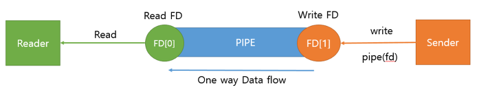
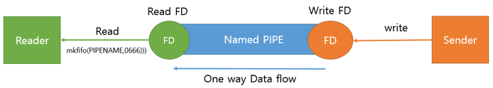
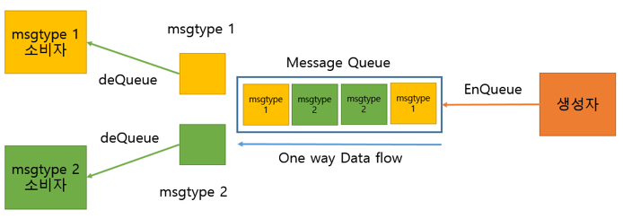
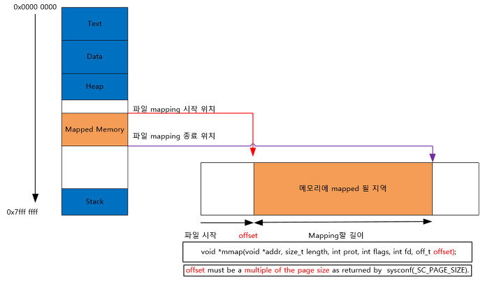

IPC(inter process communication)

- 프로세스간의 통신으로 여러 종류가 있음

1. PIPE
2. Named PIPE
3. Message Queue
4. Shared Memory
5. Memory Map
6. Socket

## PIPE

1. 정의 : 익명의 PIPE를 통해서 동일한 PPID를 가진 프로세스들 간에 단방향 통신을 지원

2. 구조

   - FIFO 구조
   - 생성된 PIPE에 대하여 Write 또는 Read만 가능

3. 사용 시기

   - 부모 자식 프로세스간 통신 할 때 사용

4. 유의 사항

   - 쌍방 통신을 위해서는 Write 용 PIPE하나 Read PIPE하나 씩 만들어야 한다.

   

```c++
#include <stdio.h>
#include <unistd.h>
#include <string.h>
#include <sys/types.h>

int main(void) {
    int     fd[2], nbytes, rc = 0;
    pid_t   childpid;
    char    string[] = "Hello, world!\n";
    char    readbuffer[80];

    if ((rc = pipe(fd)) < 0) {
        printf("Creating Pipe is Error [%d]\n", rc);
    }

    if((childpid = fork()) == -1) {
        perror("fork");
        return 0;
    }

    if (childpid == 0) {
        /* 자식 프로세스는 Write할꺼기에 Read FD는 닫아준다 */
        close(fd[0]);

        /* Pipe에 메시지 보내기 */
        write(fd[1], string, (strlen(string)+1));
        return 0;
    } else {
        /* 부모 프로세스는 Read할꺼기에 Write FD는 닫아준다 */
        close(fd[1]);

        /* Pipe에서 메시지 읽기 */
        nbytes = read(fd[0], readbuffer, sizeof(readbuffer));
        printf("Received Parent string: %s [%d]", readbuffer, nbytes);
    }

    return 0;
}
```

## Named PIPE

1. 정의
   - 이름을 가진 PIPE를 통해서 프로세스들 간에 단방향 통신을 지원
   - 서로 다른 프로세스 들이 PIPE의 이름만 알면 통신이 가능하다.
2. 구조
   - FIFO 구조
   - 생성된 PIPE에 대하여 Write 또는 Read만 가능
3. 사용 시기

   - 연관이 전혀 없는 프로세스 간에 통신을 할때
4. 유의 사항

   - 쌍방 통신을 위해서는 Write용 하나 Read용 PIPE하나 씩 만들어야 한다.

   
5. Client and Server

```c++
#include <fcntl.h>
#include <sys/stat.h>
#include <unistd.h>
#include <stdio.h>
#include <stdlib.h>

#define MSG_SIZE 80
#define PIPENAME "./named_pipe_file"

int main(void) {
  char msg[MSG_SIZE];
  int fd;
  int nread, i;

  /* named pipe 열기, Write 전용으로 열기 */
  if ((fd = open(PIPENAME, O_WRONLY)) < 0) {
    printf("fail to open named pipe\n");
    return 0;
  }

  /* Data를 보낸다. */
  for (i = 0; i < 3; i++) {
    snprintf(msg, sizeof(msg), "Send Message[%i]", i);
    if ((nread = write(fd, msg, sizeof(msg))) < 0 ) {
      printf("fail to call write()\n");
      return 0;
    }
  }
  return 0;
}
```

```c++
#include <fcntl.h>
#include <sys/stat.h>
#include <unistd.h>
#include <stdio.h>
#include <stdlib.h>


#define MSG_SIZE 80
#define PIPENAME "./named_pipe_file"

int main(void) {
  char msg[MSG_SIZE];
  int fd;
  int nread, rc;

  /* 기존에 named pipe가 있으면 삭제 */
  if (access(PIPENAME,F_OK) == 0) {
    unlink(PIPENAME);
  }

  /* named pipe 생성하기 */
  if ((rc = mkfifo(PIPENAME,0666)) < 0) {
    printf("fail to make named pipe\n");
    return 0;
  }

  /* named pipe 열기, Read Write가능 해야 한다 */
  if ((fd = open(PIPENAME, O_RDWR)) < 0) {
    printf("fail to open named pipe\n");
    return 0;
  }

  while (1) {
    if ((nread = read(fd, msg, sizeof(msg))) < 0 ) {
      printf("fail to call read()\n");
      return 0;
    }
    printf("recv: %s\n", msg);
  }
  return 0;
}
```

## Message Queue

1. 정의
   - 메모리를 사용한 PIPE
   - 구조체 기반으로 통신을 한다.
2. 구조
   - FIFO 구조
   - msgtype에 따라 다른 구조체를 가져올수 있다.
3. 사용시기

   - 프로세스간 다양한 통신을 할 때 사용할 수 있다.
4. 유의사항

   - 커널에서 제공하는 Message queue이 기에 EnQueue하는데 제한이 존재 한다.

   

## Shared Memory

1. 정의
   - 시스템 상의 공유 메모리를 통해 통신한다.
2. 구조
   - 일정한 크기의 메모리를 프로세스 간에 공유하는 구조
   - 공유 메모리는 커널에서 관리 된다.
3. 사용시기
   - 프로세스간 Read,Write를 모두 필요로 할때
4. 유의사항
   - 프로세스간 사용하려면 메모리 크기가 같아야한다.

## Memory Map

1. 정의

   - 파일을 프로세스의 메모리에 일정 부분 맵핑 시켜 사용한다.
2. 구조 
   - 디스크에 있는 파일의 블록들과 프로세스의 [페이지](https://ko.wikipedia.org/wiki/%ED%8E%98%EC%9D%B4%EC%A7%80)가 연결
   - 이 상태에서는 가상 메모리에 사상만 되어 있을 뿐이며, 실제 메모리에 파일을 불러오는 시기는 해당 주소에 읽거나 쓰기 작업을 시도할 때 이루어진다.
   - 그래서 메모리 맵 파일로 작업 중인 데이터가 실제 파일로 반영되지는 않는다.
   - [페이지 교체 알고리즘](https://ko.wikipedia.org/wiki/%ED%8E%98%EC%9D%B4%EC%A7%80_%EA%B5%90%EC%B2%B4_%EC%95%8C%EA%B3%A0%EB%A6%AC%EC%A6%98)에 따라 해당 페이지가 메모리에서 내려갈 경우, 또는 메모리 맵 파일을 닫는 과정에서 반영된다. 
   - 만약 메모리 맵 파일과 파일 입출력 API를 동시에 사용시 **동기화** 문제 발생
   - 그래서 메모리 맵 파일을 사용할 때는 읽기전용으로만 사용하는 것이 좋다.
3. 사용 시기
   - 파일로 대용량 데이터를 공유할 때 사용
   - FILE IO가 느릴때 사용하면 좋음
   - 대부분 운영체제에서는 프로세스를 실행할 때 실행 파일의 각 세그먼트를 메모리에 사상한다.
4. 유의사항
   - write시키는 프로세스의 페이지가 메모리에서 내려갈 때만 Write된다.
   - IA-32 기반 시스템에서 하나의 프로세스에서 PAE 기술을 사용하지 않고 사용 가능한 최대 크기는 4GB로 제한된다

   

Socket

1. 정의

- 네트워크 소켓통신을 시용한 데이터 공유

2. 구조

- 네트워크 소켓을 이용하여 Client - Server 구조로 데이터 통신

3. 사용시기

- 원격에서 프로세스간 데이터를 공유 할 때 사용

4. 유의 사항

- 네크워크 프로그래밍이 가능해야 한다.

- 데이터 세그먼트 처리를 잘해야한다.