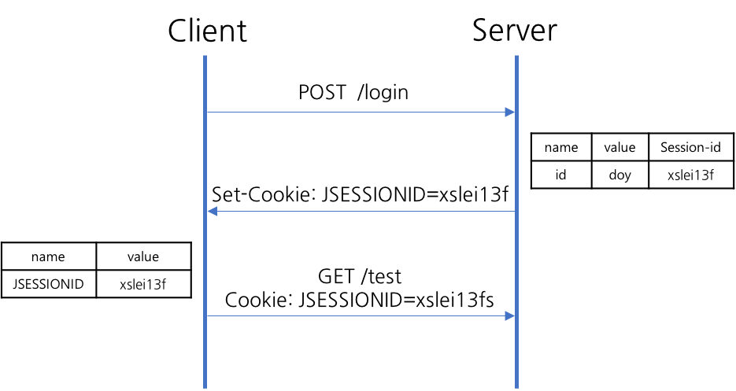

# INDEX

- [컴퓨터 네트워크](#%EC%BB%B4%ED%93%A8%ED%84%B0-%EB%84%A4%ED%8A%B8%EC%9B%8C%ED%81%AC)
    - [네트워크 관련 기초 용어 정리](#%EB%84%A4%ED%8A%B8%EC%9B%8C%ED%81%AC-%EA%B4%80%EB%A0%A8-%EA%B8%B0%EC%B4%88-%EC%9A%A9%EC%96%B4-%EC%A0%95%EB%A6%AC)
  - [네트워크 주소의 표현](#%EB%84%A4%ED%8A%B8%EC%9B%8C%ED%81%AC-%EC%A3%BC%EC%86%8C%EC%9D%98-%ED%91%9C%ED%98%84)
  - [교환 시스템](#%EA%B5%90%ED%99%98-%EC%8B%9C%EC%8A%A4%ED%85%9C)
  - [LAN,MAN,WAN](#lanmanwan)
  - [인터네트워킹](#%EC%9D%B8%ED%84%B0%EB%84%A4%ED%8A%B8%EC%9B%8C%ED%82%B9)
    - [오류 제어 및 흐름 제어](#%EC%98%A4%EB%A5%98-%EC%A0%9C%EC%96%B4-%EB%B0%8F-%ED%9D%90%EB%A6%84-%EC%A0%9C%EC%96%B4)
    - [오류제어](#%EC%98%A4%EB%A5%98%EC%A0%9C%EC%96%B4)
    - [흐름 제어](#%ED%9D%90%EB%A6%84-%EC%A0%9C%EC%96%B4)
  - [프레임 및 다항 코드](#%ED%94%84%EB%A0%88%EC%9E%84-%EB%B0%8F-%EB%8B%A4%ED%95%AD-%EC%BD%94%EB%93%9C)
    - [문자 프레임](#%EB%AC%B8%EC%9E%90-%ED%94%84%EB%A0%88%EC%9E%84)
    - [비트 프레임](#%EB%B9%84%ED%8A%B8-%ED%94%84%EB%A0%88%EC%9E%84)
    - [패리티 비트](#%ED%8C%A8%EB%A6%AC%ED%8B%B0-%EB%B9%84%ED%8A%B8)
    - [블록 검사](#%EB%B8%94%EB%A1%9D-%EA%B2%80%EC%82%AC)
    - [다항 코드](#%EB%8B%A4%ED%95%AD-%EC%BD%94%EB%93%9C)
  - [데이터 링크 계층 프로토콜의 기초](#%EB%8D%B0%EC%9D%B4%ED%84%B0-%EB%A7%81%ED%81%AC-%EA%B3%84%EC%B8%B5-%ED%94%84%EB%A1%9C%ED%86%A0%EC%BD%9C%EC%9D%98-%EA%B8%B0%EC%B4%88)
  - [네트워크 계층의 기능](#%EB%84%A4%ED%8A%B8%EC%9B%8C%ED%81%AC-%EA%B3%84%EC%B8%B5%EC%9D%98-%EA%B8%B0%EB%8A%A5)
    - [혼잡제어 vs 흐름제어](#%ED%98%BC%EC%9E%A1%EC%A0%9C%EC%96%B4-vs-%ED%9D%90%EB%A6%84%EC%A0%9C%EC%96%B4)
    - [라우팅 프로토콜](#%EB%9D%BC%EC%9A%B0%ED%8C%85-%ED%94%84%EB%A1%9C%ED%86%A0%EC%BD%9C)
  - [IP 프로토콜](#ip-%ED%94%84%EB%A1%9C%ED%86%A0%EC%BD%9C)
  - [IP v6 프로토콜](#ip-v6-%ED%94%84%EB%A1%9C%ED%86%A0%EC%BD%9C)
  - [전송 계층](#%EC%A0%84%EC%86%A1-%EA%B3%84%EC%B8%B5)
  - [TCP와 UDP](#tcp%EC%99%80-udp)
  - [TCP의 3 way handshake와 4 way handshake](#tcp%EC%9D%98-3-way-handshake%EC%99%80-4-way-handshake)
  - [소켓의 주소 체계와 서비스](#%EC%86%8C%EC%BC%93%EC%9D%98-%EC%A3%BC%EC%86%8C-%EC%B2%B4%EA%B3%84%EC%99%80-%EC%84%9C%EB%B9%84%EC%8A%A4)
  - [HTTP와 HTTPS](#http%EC%99%80-https)
  - [쿠키와 세션](#%EC%BF%A0%ED%82%A4%EC%99%80-%EC%84%B8%EC%85%98)

## 컴퓨터 네트워크 

#### 네트워크 관련 기초 용어 정리

- 네트워크란 무엇인가?

  **네트워크** 란 전송매체를 매개로 서로 연결되어 데이터를 교환하는 시스템의 모음이며 시스템과 전송매체의 연결 지점에 대한 규격이 존재하며 또한 시스템이 교환할 때는 임의의 통신 규칙이 적용된다.

- 시스템

  내부 규칙에 따라 능동적으로 동작하는 대상을 가리킨다. 우리가 일상 생활에서 볼 수 있는 다양한 기기들이 모두 시스템의 한 형태이다. 

  - 노드 

    노드는 인터넷에 연결된 시스템을 가장 일반화한 용어이다. 데이터를 주고받을 수 있는 모든 시스템이다.

  - 호스트

    일반적으로 컴퓨팅 기능이 있는 시스템을 의미한다.

- 클라이언트 and 서버

  클라이언트는 서비스를 이용하는 시스템이고, 서버는 서비스를 제공하는 시스템이다. 호스트는 다양한 서비스를 상호작용으로 주고받는다. 따라서 임의의 호스트는 클라이언트가 될수도 서버가 될수도 있다.

- 인터페이스

  인터페이스는 시스템과 시스템을 연결하는 표준화된 접근 방법이다. 네트워크의 정의에서 시스템과 전송 매체의 연결 지점에 대한 규격이 존재한다고 했는데 이부분이 바로 인터페이스이다.

- 프로토콜

  상호 연동되는 시스템이 전송 매체를 통해 데이터를 교환할 때 표준화된 특정 규칙을 따르는데 이 규칙을 프로토콜이라고 합니다.

- 인터넷

  인터넷은 전 세계의 모든 네트워크가 유기적으로 연결되어 동작하는 통합 네트워크이다. 데이터 전달 기능에서 IP 프로토콜을 사용한다. IP는 Internet Protocol을 의미한다.

각각의 호스트들은 OSI 7 계층을 가지고 통신기능을 수행합니다.

- 국제표준화기구(ISO)에서 개발한 모델로, 컴퓨터 네트워크 프로토콜 디자인과 통신을 계층으로 나누어 설명한 것이다.
- 이 모델은 프로토콜을 기능별로 나눈 것이다.
- 각 계층은 하위 계층의 기능만을 이용하고, 상위 계층에게 기능을 제공한다.
- '프로토콜 스택' 혹은 '스택'은 이러한 계층들로 구성되는 프로토콜 시스템이 구현된 시스템을 가리키는데, 프로토콜 스택은 하드웨어나 소프트웨어 혹은 둘의 혼합으로 구현될 수 있다.
- 일반적으로 하위 계층들은 하드웨어로, 상위 계층들은 소프트웨어로 구현된다.

1. 물리계층(Physical layer)
   - 네트워크의 기본 네으퉈크 하드웨어 전송 기술으 이룬다.
   - 네트워크의 높은 수준기능의 논리데이터 구조를 기초로 하는 필수 계층
2. 데이터 링크계층(Data Link layer)
   - Point to Point 간 신뢰성있는 전송을 보장하기 위한 계층으로 CRC기반의 오류제어와 흐름 제어가 필요하다.
   - 주소 값은 물리적으로 할당 받는데, 이는 네트워크 카드가 만들어질 때부터 맥 주소(MAC address)가 정해져 있다는 뜻이다.
   - 데이터 링크 계층의 가장 잘 알려진 예는 이더넷이다.
3. 네트워크 계층(Network layer)
   - 여러개의 노드를 거칠 때마다 경로를 찾아주는 역할을 하는 계층으로 다양한 길이의 데이터를 네트워크를 통해 전달 하고 그 과정에서 전송계층이 요구하는 서비스품질(QoS)를 제공하기 위한 기능적,절차적 수단을 제공한다.
   - 네트워크 계층은 라우팅,흐름제어,세그멘테이션,오류제어,인터네트워킹 등을 수행한다.
4. 전송 계층(Transport layer)
   - 양 끝단의 사용자들이 신뢰성있는 데이터를 주고받을 수 있또록 해 주어, 상위 계층들이 데이터 전달의 유효성이나 효율성을 생각하지 않도록 해준다.
   - 시퀀스 넘버 기반의 오류제어 방식을 사용한다.
   - 전송 계층은 특정 연결의 유효성을 제어하고, 일부 프로토콜은 상태개념이 있고(stateful), 연결 기반 이다.
   - 가장 잘 알려진 전송계층의 예는 TCP
5. 세션 계층(Session layer)
   - 양 끝단의 응용 프로세스가 통신을 관리하기 위한 방법을 제공한다.
   - 동시 송수신 방식,반 이중 방식,전이중 방식의 통신과 함께,체크 포인팅과 유휴,종료,다시 시작 과정 등을 수행한다.
   - 이 계층은 TCP/IP 세션을 만들고 없애는 책임을 진다.
6. 표현 계층(Presentation layer)
   - 코드간의 번역을 담당하여 사용자 시스템에서 데이터의 형식상 차이를 다루는 부담을 응용 계층으로 부터 덜어준다.
   -  MIME 인코딩이나 암호화 등의 동작이 이 계층에서 이루어진다.
7. 응용 계층(Application layer)
   - 응용 프로세스와 직접 관계하여 일반적인 응용 서비스를 수행한다.
   - 일반 응용 서비스는 관련된 응용 프로세스들 사이의 전환을 제공한다.

------

### 네트워크 주소의 표현

시스템 사이에 데이터를 주고받기 위해서는 시스템 각각의 고유한 값을 가지고 있어야한다. 그래야 정확하게 원하는 목적지에 데이터를 줄 수 있기 때문이다.이러한 고유의 구분자를 숫자로 된 주소로 표현한다.

DNS(Domain Name System)

- 우리가 인터넷을 통해 특정 호스트에 연결을 하려고한다면 그 특정 호스트 의 주소(IP)를 알고 있어야 한다. 그러나 숫자로 된 IP주소를 일일이 기억하는 것은 매우 힘들기 때문에 호스트가 이름을 입력했을 때 그에 맞는 IP값을 반환하는 장치인 DNS가 필요

- DNS 시스템은 국가 도메인, 단체 종류, 단체 이름, 호스트라는 네 계층 구조로 나누고 점을 이용하여 구분을 한다. 우리가 일반적으로 사용하는 인터넷 사이트 주소를 입력하는 방식이다. 또한 DNS는 주소와 이름 정보를 자동으로 유지하고 관리하는 분산 데이터베이스 시스템의 형태이기도

  하다. 네임 서버라는 특정한 관리 호스트가 주소와 이름 정보를 기억하고 클라이언트가 주소 변환을 요청하면 이름을 IP주소로 바꾸어준다.

— TCP / IP 모델 — 

인터넷은 데이터 중개 기능을 담당하는 네트워크 계층으로 IP 프로토콜을 사용하는 네트워크이다. 따라서 인터넷에 연결하고자 하는 호스트는 반드시 IP 프로토콜을 지원해야하며, 전송 계층은 TCP 나 UDP를 사용한다.

컴퓨터 네트워크 구현 모델은 사용자 공간과 시스템 공간으로 이루어진다. 앞선 장에서 말했듯이 전송 계층 까지의 4계층은 시스템 공간인 운영체제 내부에 구현된다. TCP/IP 와 하위 계층의 기능을 담당하는 LAN카드 드라이버 루틴은 운영체제 영역에 속한다. 사용자 공간에는 다양한 프로세스가 존재가능

- 시스템 공간

  TCP와 UDP는 시스템 운영체제인 커널 내부에 구현되어 사용자가 직접 이용할 수 없다. 대신 소켓 인터페이스라는 전송 계층의 프라미티브를 사용해서 시스템 콜 기능으로 호출한다. TCP는 연결형 서비스를 UDP 는 비연결형 서비스를 제공한다. 네트워크 계층은 IP로 구현되며,네트워크 계층은 라우터를 통한 전송 패킷의 올바른 경로 선택 기능을 제공한다.

- 사용자 공간

  세션 계층부터 상위 3개의 계층은 사용자 프로그램을 구현한다. 소켓 시스템 콜을 이용하여 TCP와 UDP 기능을 사용할 수 있다. 소켓은 각자 고유한 포트 번호를 관리한다. 이러한 포트 번호와 사용자 프로그램 간의 일대일로 대응하여 시스템 콜을 주고받는다. 응용 프로그램에 따라 포트 번호를 여러 개 받을 수도 있다.

- TCP / IP 계층구조

  인터넷에서의 데이터 전송은 계층 4의 TCP/UDP,  계층 3의 IP에 의해 이루어진다. 하지만 이 프로토콜만으로는 이루어지지는 않는다. 이를 보안해줄 ARP/RARP와 ICMP 프로토콜이 같이 작용을 돕는다. 네트워크 응용 프로크램은 TCP와 UDP 를 사용해 데이터 송수신 기능을 수행하지만,네트워크 계층의 IP 프로토콜을 직접 사용하기도 한다. ICMP와 ARP/RARP는 네트워크 계층에 포함되며 IP의 동작을 도와준다.

  -  ICMP : IP가 동작하는 과정에서의 전송 오류를 복구하는 담당 오류메세지 전송을 위한 별도의 헤더구조 보유
  - ARP/RARP : IP주소와 MAC주소 관계를 이어주는 역할을 한다. 데이터 링크 계층의 MAC 주소와 네트워크 계층의 IP주소는 TCP/IP 모델의 중요한 주소들이다. 데이터 링크 계층을 이용해 데이터를 전송하려면 목적지 호스트의 MAC 주소가 필요하다. 그래서 IP 주소를 바탕으로 MAC 주소를 가르쳐주는 ARP가 필요하다. 반대로 MAC 주소를 토대로 IP 주소를 알아내는 것이 RARP이다.

  

------

### 교환 시스템

- 회선 교환

  회선 교환 방식은 고정 대역을 할당한 연결을 설정하여 데이터 전송을 시작한다. 다른 말로 하자면 데이터가 전송 될 때 지나가는 길이 정해져 있는것. 이 방식은 안정적인 전송률을 가질수 있고 라우팅 작업이 수월하다. 논리적인 전송 선로를 전용으로 할당받아 모든 데이터가 같은 경로로 전달된다.

- 패킷 교환 

  패킷이라는 일정 크기로 나누어 전송하며 각 패킷은 독립적으로 라우팅 과정을 거쳐 목적지에 도달하는 방식. 가상 회선 방식과 데이터 그램 방식을 나누어진다.

  - 가상 회선 방식 - 데이터를 패킷 단위로 전송하지만 송수신 호스트 사이에 가상 연결을 설정 하여 모든 패킷의 전달 경로가 동일
  - 데이터 그램 방식 - 패킷 자체를 완전히 독립적으로 전송하므로 양이 적거나 신뢰성이 중요하지 않은 환경에서 사용. 경로를 미리 할당받지 않기때문에 데이터의 도착순서가 자주바뀌기 때문.

- 패킷 교환의 장점

  - 전송 대역의 효율적 이용

    전송한 패킷들이 동적인 방식으로 전송 대역을 공유하기 때문에 전송 선로의 이용 효율을 극대화 할 수 있다. 쉽게 말하자면 막힌 길과 뚫린 길을 읽을 수 있어 데이터를 조금 더 효율적으로 보낼 수 있다는 것이다.

  - 호스트의 무제한 수용

    회선 교환 방식은 모든 회선 연결에 할당된 대역의 합이 전체 네트워크 전송 용량을 초과할 수 없다. 그러나 패킷 교환 방식은 전송 대역이 부족해 연결 설정 요청을 수용하지 못하는 경우가 없다. 하지만 호스트가 늘어나면 네트워크가 혼잡해져 전송 지연이 심화된다.

  - 패킷에 우선 순위 부여

    패킷이라는 단위로 데이터가 움직이기 때문에 우선순위를 부여하여 패킷을 따로 처리할 수 있다.

- 패킷 교환 방식은 개발된 시점에 많은 오류 존재. 따라서 오버헤드 비트를 추가하여 오류를 해결. 오류제어를 위해 필요한 환경을 전송 속도를 높여주는 방식으로 개선한 방식이 프레임 릴레이,셀 릴레이 


- 프레임 릴레이 

  프레임 릴레이는 동일한 속도의 전송 매체로 고속 데이터 전송을 지원할 수 있도록 고안된 기술, 각 라우터의 개별 연결을 의미하는 홉단위의 흐름 제어와 오류 제어 기능을 수행하지 않는다. 즉 중간 노드를 지나칠 때마다 데이터 수신에 대한 응답을 보내야 하는데 이 과정을 무시하고 전체 큰 단위의 응답만 수행하여 응답을 처리하는데 들이는 시간을 줄인다.

- 셀 릴레이

  셀 릴레이는 ATM(Asynchronous Transfer Mode)라고도 불리는데 셀이라는 고정 크기의 패킷을 사용한다. 고정된 크기의 패킷을 사용하면 가변적일 때 보다 오버헤드를 줄일 수 있어 전송률이 빨라진다.

------

### LAN,MAN,WAN 

호스트 사이의 연결 거리를 기준으로 lan,man,wan을 구분한다.

- LAN

  LAN은 단일 건물이나 학교 같은 소규모 지역에 위치하는 호스트로 구성된 네트워크이다. 호스트의 간격이 가깝기 때문에 브로드캐스팅 방식으로 전송한다. 브로드캐스팅 방식은 앞에서 설명하였지만 다시 한 번 집어보자면 일대다 통신의 대표적인 유형으로 네트워크에 연결된 모든 호스트에 데이터를 전송할 수 있는 방식이다. LAN 환경에서 호스트를 연결하는 방식으로는 버스형과 링형이 있다.

- MAN

  MAN은 LAN보다 조금 큰 규모를 지원한다. 한 도시의 네트워크까지 연결이 가능하다. MAN은 DQDB 국제 표준안을 가지고 있는데 전송 방향이 다른 두 버스로 모든 호스트를 연결하는 구조이다. 분산 데이터 큐를 유지하며 충돌 문제를 해결하기 위해 FIFO기반의 공유 슬록 방식을 사용한다. 두 버스를 이용하여 두 개의 단방향 선로가 존재하게 되고 이 전송 선로로 모든 호스트가 연결된다.

- WAN

  국가 이상의 넓은 지역을 지원하는 네트워크가 WAN이다. 매우 큰 네트워크를 지원하기 때문에 브로드캐스팅 방식을 취하지 않고 점재점의 환경을 지원한다. 따라서 교환 기능이 필요하다. 모두에게 데이터를 보내는 것이 아니라 특정 호스트에게만 데이터를 보내야하기 때문이다.

### 인터네트워킹

인터네트워킹은 둘 이상의 서로 다른 네트워크를 연결하는 기능이다. 지금까지는 한 네트워크 안에서의 데이터 교환을 보았다면 지금부터는 네트워크 간의 교환 기능을 말한다. 이러한 교환은 라우팅 장비가 수행한다. 인터네트워킹 기능을 수행하는 시스템을 일반적으로 게이트웨이라고 한다. 게이트웨이는 앞서 말한 중개노드와 같은 역할을 한다고 할 수 있다. 게이트웨이는 기능에 따라 리피터, 브리지, 라우터로 구분된다.

- 리피터 - 계층 1의 기능을 지원한다. 한쪽 단에서 들어온 비트 신호를 증폭하여 다른 단으로 단순히 전달하는 역할을 한다. 신호를 증폭하는 것이 이로운 점도 있지만 잡음도 같이 증폭을 한다는 점에서 단점도 존재한다.
- 라우터 - 계층 3의 기능을 지원한다. 교환 기능을 수행할 수 있으므로 여러 포트를 사용해 다수의 LAN을 연결하는 구조를 지원한다. 경로 배정 기능을 수행한다.
- 브리지 -계층 2의 기능을 지원한다. 한쪽 단에서 들어온 프레임의 MAC 계층 헤더를 다른 단의 MAC 계층 헤더로 변형해 전송할 수 있어 종류가 다른 LAN을 연결할 수 있다. 각 단의 데이터의 형태가 다를 경우 헤더 변형을 통해 각 단에 해당하는 데이터로 변형이 가능하다. 각 호스트의 주소가 같은 네트워크 상일 경우에는 브리지는 아무 일도 하지 않는다.

------

#### 오류 제어 및 흐름 제어 

#### 오류제어

- 송신 측은 수신 측이 정상적으로 수신하였다는 사실을 어떻게 알 수 있겠는가?

  QnA : 이는 응답메커니즘에 의해 알수 있다. **긍정 응답**을 할 경우 제대로 받았다는것 

- 전성한 데이터가 중간에 손실된 경우는 어떻게 알 수 있는가?

  QnA : 수신 측에서 판단할 방법은 없다. 송신측에서 **타이머** 를 설정하여 주어진 시간동안 긍정응답이 오지않으면 손실로 간주한후 재전송

- 수신 측에서 전송 과정 측에 변형이 일어났는지 어떻게 확인하는가?

  QnA : 송신측에서 데이터와 함께 변형여부를 판단할 제어 정보를 덧붙여서 보냄

- 수신측에서 데이터가 변형되었다는것을 알았을때 어떻게 대응하는가?

  QnA : 첫번째로 부정응답 두번째는 무응답 부정응답은 응답에 대한 정보를 만들어야하므로 복잡해질수 있음 무응답은 타임아웃까지 기다려야하므로 시간이 소요

- 정상 응답이 손실되는 경우는 어떤 상황이 벌어지나?

  QnA : 송신 측에서는 타임아웃이 되어 데이터의 손실로 간주되며 데이터 재전송이 일어날 것이다. 이럴 경우 수신 호스트에 다시 데이터가 들어오게 되는데 수신 측에서는 새로운 데이터인지 중복되어 들어온 데이터인지 구분할 수 있는 방법이 없다. 따라서 새로 데이터가 들어온 것으로 인지를 하여 중복 수신이 발생하게 된다. 따라서 이를 구분할 수 있는 방법이 필요하다. 그런 방법이 바로 순서번호이다. 송신 호스트가 데이터를 전송할 때 순서번호를 붙여 보내게 되므로 수신 호스트는 데이터를 고유한 순서번호에 따라 구별할 수 있다.

#### 흐름 제어 

오류제어와 함께 데이터 링크 계층해서 제공 데이터 프레임의 전송 속도를 조절하는 역할을 한다.송신 호스트는 수신 호스트가 감당할 수 있을 정도의 전송 속도를 유지하면서 전송을 한다. 수신 호스트는 바로 처리가 어려운 경우 버퍼를 이용하여 데이터를 저장한다. 하지만 저장할 공간이 없을 경우 데이터 손실이 발생할 수 있다. 따라서 흐름 제어에 의해 다음에 수신할 프레임의 전송 시점을 송신 호스트에게 통지하는 방식을 취한다. 또 응답을 받지 않고도 전송할 수 있는 데이터의 양도 송신 호스트에게 통지한다.  

------

### 프레임 및 다항 코드

데이터 링크 계층에서는 전송 데이터를 프레임이라는 작은 단위로 나누어 처리.

전송  프레임에서는 상위 계층에서 보낸 전송 데이터의 오류를 확인하기 위한 체크섬,송수신 호스트의 주소,기타프로토콜에서 사용하는 제어코드 같은 정보가 포함된다. 프레임은 내부 정보를 표현하는 방식에 따라 문자 프레임과 비트 프레임으로 나누어진다.

#### 문자 프레임

- 프레임의 내용이 문자로만 구성된다. 프레임의 시작과 끝에 특수 문자를 사용하여 구분하는데 시작에는 DLE/STX가 나오고 끝에는 DLE/ETX를 두어 프레임을 다른 정보와 구분하게 된다. 하지만 데이터 안에도 DLE/STX나 DLE/ETX 와 같은 문구가 포함되어 있을 수 있어 데이터를 읽는 과정에서 혼선을 일으킬 수 있다. 이러한 문제를 해결하기 위해 문자 스터핑이라는 기법을 사용한다. 문자 스터핑은 데이터에 DLE가 존재하면 강제로 DLE를 추가하는 작업을 한다. DLE가 두 개가 연달아 나오게 되기 때문에 특수 문자로 인식하지 않는다. 수신측에서 두 개의 DLE가 나오면 뒤에 있는 DLE를 제거하여 데이터를 읽는다.

#### 비트 프레임

- 임의의 비트 패턴을 전송. 문자 프레임의 경우 문자를 사용하기 때문에 8비트로 떨어져야 하는 반면 비트프레임은 그자체가 데이터가 되므로 어떠한 비트크기를 가져도 상관이 없다. 비트 프레임은 시작과 끝을 알리는 비트패턴으로 플래그를 사용한다(01111110) 하지만 비트프레임 역시 데이터에도 플래그와 같은 값을 가지는 비트가 존재 할 수 있기 때문에 비트 스터핑을 이용 이를 구분한다. 1이 연속 5개가 오면 강제로 0을 추가해서 플래그와 겹치지않게 함. 수신척에서는 읽을때 0을 제거해서 읽어들어간다.

프레임 전송 과정에서 발생하는 오류를 극복하는 방법은 크게 두 가지이다. 오류 검출 코드를 넣어 수신 호스트가 오류 검출 후 재전송을 복구하는 방법과 오류 복구 코드를 넣어 수신 호스트가 오류 검출과 복구를 동시에 수행하는 방법이다. 여기에서는 오류 검출에 대해 알아볼 것이다. 오류 검출을 하는 방법에는 3가지가 있다. 패리티 비트, 블록 검사, 다항코드로 오류 검출을 수행할 수 있다.

#### 패리티 비트

- 8비트 구조에서 패리티비트 1비트를 포함시켜 1비트 오류를 검출하는 방식. 전체 1의 개수를 짝수로 맞추기 위해서 패리티 비트를 조절 비트가 오류가나게되면 1의 개수가 홀수가 되기 때문에 오류가 발생했다는 사실을 인지가능.홀수로 지정도 가능

#### 블록 검사

- 패리티비트의 단점을 보완한 것. 데이터에서 1비트 오류가 아니라 복수의 데이터 오류가 발생했을 시 짝수와 홀수가 변하지 않을 수 있다. 블록검사는 여러개의 바이트 데이터를 수평방향과 수직방향 모두에 패리티 비트를 만들어 검사를 수행.하지만 전송되는 양에 비해 검사를 위한 오버헤드가 크다.

#### 다항 코드

- CRC로 알려져 있음. 현재의 통신 프로토콜에서 가장 많이 사용하는 오류 검출 방법. 다항 코드는 다항식형태를 기반으로 오류를 검출하는 방식. 송신 호스트가 전송할 데이터가 m비트의 M(x)라면 데이터 전송과정에서 n+1비트의 생성 다항식을 G(x)를 이용하여 오류 검출 코드생성.오류 검출 코드는 송신 호스트가 전송 데이터 M(x)를 생성 다항식 G(x)로 나누어 얻는다. 나누기 위해서 전송 데이터의 끝 부분에 n비트의 공간을 만들어 0으로 채워 넣는다. 나누기 연산을 수행한 후 얻은 나머지 값을 전송데이터 뒤의 n비트 공간에 넣는다.
-  이렇게 만들어진 m+n 데이터를 수신 호스트에 전달하게 된다. 그리고 수신 호스트는 전송 오류가 발생했는지를 판단하기 위해 수신한 m+n비트의 데이터를 생성 다항식으로 나누는 연산을 수행한다. 연산 결과 얻은 나머지가 0이면 전송 오류가 없다고 판단하고, 0이 아니면 오류가 발생했다고 판단할 수 있다.

------

### 데이터 링크 계층 프로토콜의 기초

데이터 링크 계층에서 사용하는 데이터의 단위는 **프레임** 이다 . 프레임에는 3가지 종류가 존재한다.

1. 정보 프레임
2. 긍정 응답 프레임
3. 부정 응답 프레임

정보프레임은 상위 계층이 전송 요구한 데이터를 송신하는 용도로 사용된다. 순서번호,송수신 호스트 정보 등이 포함 되어 있다.

긍정 응답 프레임(ACK 프레임 : Positive Acknowledgement)은 전송 데이터가 올바르게 도착했음을 회신하는 용도로 사용된다. 수신자 측이 송신자 호스트에게 전송하는 프레임.

부정 응답 프레임(NAK 프레임: Negative Acknowledgment)은 전송 데이터가 깨져서 도착했음을 알리는 회신하는 용도로 사용된다.데이터를 수신한 호스트가 데이터를 송신한 호스트에게 정손. 송신자 측은 다시 원래의  데이터를 재전송하여 오류를 복구시킨다.

긍정,부정 프레임 모두 순서번호를 포함하고 있음.


------

### 네트워크 계층의 기능

네트워크 계층의 기본 기능은 **라우팅**이다.  라우팅은 송수신 호스트 사이의 패킷 전달 경로를 선택하는 역할을 한다. 라우팅을 위해서 라우팅 테이블을 가지고 있는데 네트워크 구성 형태

네틍 ㅓ크 계층에서 제공하는 서비스는 연결형 서비스와 비연결형 서비스로 나뉜다.

- 연결형 서비스

  데이터 전송 전에 데이터의 전송 경로를 미리 결정하는 것.

  연결형 서비스는 비연결형 서비스보다 신뢰성이 높다. 미리 경로가 설정되어 있으므로 패킷의 도착순서가 일정하다. TCP가 대표적인 예시가 되는데 전송 계층의 기능을 지원하는 연결형 프로토콜이다.

- 비연결형 서비스

  데이터의 전송 경로를 사전에 결정하지 않고 패킷 단위로 결정하는 것을 나타낸다. 비연결형 서비스는 패킷이 서로 다른 경로로 전송되므로 도착순서가 일정하지 않다. 따라서 상위 계층에서 순서를 재조정해야한다. 패킷 분실 가능성도 존재한다. 연결 경로가 정해져 있지 않으므로 상위 계층에서 패킷 분실 오류를 복구하는 기능이 필요하다. IP와 UDP가 대표적 예시이다.

라우팅은 패킷의 전송 경로를 지정하는 행위. 따라서 공평원칙과 효율원칙을 만족 시켜야한다.

- 공평원칙 : 다른 패킷의 우선 처리를 위해 다른 패킷이 손해를 보면 안 된다는 것
- 효율원칙 : 패킷의 평균지연시간이나 중간에 거쳐 가는 라우터의 수 등 전체 네트워크의 효율성에 대해 고려한 것

라우팅은 정적 라우팅과 동적라우팅으로 나누어 질 수 있다.

- 정적 라우팅 : 패킷 전송이 이루어지기 전에 경로를 미리 라우터가 저장하여 중개. But 경로 정보의 갱신이 어려으므로 네트워크 변화,혼잡에 대처하기 힘들다.
- 동적 라우팅 : 라우터의 경로 정보가 네트워크 상황에 따라 적절하게 변경이 가능한 라우팅이다. 경로 정보 변경 주기에 따라 보완이 가능하다는 장점. but 이로인해 복잡한 작업 추가 . 경로의 수집과 관리로 인한 성능저하 발생 가능성

라우팅에서 쓰는 패킷으로 HELLO 패킷, ECHO 패킷 존재.

- HELLO :  주변에 HELLO 패킷을 보내어 주변 경로 파악. 
- ECHO : 라우터 사이의 전송 지연 시간을 측정 ECHO패킷을 수신하면 송신측에 즉시 회신

라우팅 테이블 : 라우터가 패킷의 적절한 경로를 찾기 위한 가장 기본적인 도구. 목적지 호스트와 다음 홉에 대한 정보 보유 (목적지 호스트 : 패킷의 최종 목적지 호스트,다음 홉 : 목적지 호스트 까지 패킷을 전달하기 위한 인접 경로)

라우팅을 처리하는 여러가지 방법이 존재.

1.  소스 라우팅 : 송신 호스트가 패킷의 전달 경로를 결정. 전송 경로는 패킷 내부에 기록
2. 분산 라우팅 : 라우팅 정보를 분산하여 관리. 호스트의 개수가 많을 수록 효과적
3. 중앙 라우팅 : 특정 호스트가 모든 라우팅 정보를 관리 
4. 계층 라우팅 : 분산 라우팅 + 중앙 라루팅 , 특정 부분들을 나누어 처리. 규모가 커질수록 효과적

#### 혼잡제어 vs 흐름제어

흐름제어 : 송수신 호스트 사이의 전송 속도 문제를 처리, 끝과 끝 호스트 사이의 문제

혼잡제어 : 네트워크에서의 전송 능력 문제를 해결,호스트와 호스트 사이의 모든 망안에서의 문제

혼잡 제어에서 트레픽 성형이라는 것이 있는데 패킷 발생 정도를 네트워크에서 예측 가능한 정도로 조절하는 것을 의미한다. 혼잡의 발생은 트레픽이 특정 시간에 집중되는 버스트 현상으로 발생을 하는 경우가 많으므로 이를 조절하는 것이 필요하다. 이러한 트레픽 성형을 해주는 알고리즘이 바로 리키 버킷 알고리즘이다. 깔대기라는 버퍼를 사용하여 송신 호스트에서 나오는 데이터의 가변율을 고정율로 협상하여 일정한 전송률을 가지게 만들어 트레픽을 줄이는 알고리즘이다.

혼잡 제거는 특정 지역의 혼잡이 다른 지역으로 확대되지 않도록 하는 작용이다. 혼잡 제거를 위한 방식으로 자원 예약 방식과 ECN 패킷 방식이 존재한다. 자원 예약 방식은 호스트와 서브넷이 미리 네트워크 자원의 사용 정도를 협상하여 사전 예약하는 것을 의미한다. 하지만 이런 점은 자원이 낭비가 될 가능성이 존재한다. ECN 패킷 방식은 출력 경로를 사용하는 빈도를 모니터하여 한계치가 넘어가면 송신 호스트에게 주의 표시를 보내준다. ECN 패킷을 받은 호스트는 ECN 패킷이 더 이상 오지 않을 때까지 송신 패킷 양을 줄인다.

------

#### 라우팅 프로토콜

- 최단 경로 라우팅

  거리 기준은 다양하지만 중간에 거쳐 가는 홉 수로 판단을 한다. 패킷이 목적지로 가는 동안 통과하는 라우터 수가 최소가 되도록 경로를 선택하는 방법을 택한다. 기타 거리 기준으로는 패킷의 전송 지연이나 전송 대역폭, 통신비용도 사용할 수 있다.

- 플러딩 라우팅

  라우터가 입력된 패킷을 출력 가능한 모든 경로로 중개하는 방식을 취한다. 네트워크 패킷이 무한개까지 만들어질 수 있으므로 홉 수를 일정 범위로 제한하여 제거를 해야 한다. 이와 같은 경우는 중요한 데이터를 모든 호스트에게 동시에 전달하는 환경에서 제한적으로 사용한다.

  

  - 거리 벡터 라우팅 프로토콜 

    라우터가 자신과 직접 연결된 주변 라우터에게 라우팅 정보를 교환하는 방식. 전체 네트워크에 대한 지식을 이웃라우터에게만 일정 주기로 공유.

    전체 네트워크에 속하는 개별 네트워크까지 걸리는 거리 정보를 가진다. 개별 라우터에서 유지하는 필수 정보는 링크 벡터,거리 벡터,다음 홉 벡터

    - 링크벡터 : 직접 연결된 네트워크에 대한 연결 정보
    - 거리벡터 : 전체 개별 네트워크에 대한 거리 정보
    - 다음 홉 벡터 : 개별 네트워크로 가기 위한 다음 홉 정보

    RIP(Routing Information Protocol) 

    - 소규모 환경에 적합.
    - 주변 라우터가 제공하는 거리벡터정보가 임의의 짧은 시간 내에 모두 도착해야함. but 현실적으로 구현이 어려움
    - 라우팅 정보 수정중 거리벡터 정보가 새로운 네트워크 주소면 적응 시키고 목적지까지의 지연시간이 더 적으면 기존 경로를 대체

  - 링크상태프로토콜

    - 거리벡터 프로토콜의 단점을 개선. 주변 상황에 변화가 있을때 주변 라우터까지의 정보를 모든 라우터에게 전달
    - 개별 라우터가 이웃 라우터까지의 거리 정보를 구한 후 이를 네트워크에 연결된 모든 라우터에 통보.
    - 정보 전달을 하기 위해 플러딩 기법 이용.
    - ex) OSPF 프로토콜

  - 외부 라우팅 프로토콜
    - 앞의 내부 라우팅 용도와 다른 방식.
    - 외부 라우팅 프로토콜에서 사용하는 경로벡터는 경로 관한 거리 정보 값이 필요가 없다.
    - 내부 라우팅 프로토콜고 다른점은 거리에 대한 처리 과정이 없다는 것. 목적지 네트워크에 도착하기 위한 자율 시스템에 대한 내용만 포함 - 단순히 해당 라우터에서 어느 네트워크가 연결 가능한지에 대한 정보만을 제공
    - ex ) BGP 인터넷에 많이 사용

  

  ------

  ### IP 프로토콜

  

  ip 프로토콜은 인터넷 환경에서 네트워크 계층의 데이터 전송 프로토콜이다. 

  - 비연결형 서비스
  - 패킷 분할/병합 기능
  - No Data CheckSum, Only Header CheckSum
  - Best-effort 방식(100퍼센트 패킷전송 보장안함)
  - 최대 Packet 의 크기는 65,535바이트

  

  IP Frame

  - Version : 현재 IP의 버전표시, 4

    - Length : IP Header의 길이
    - service Types : 송신한 IP datagram이 요구하는 서비스 품질. 우선도 지정, 지연이 적은 경로의 요구, 전송효율과 높은경로등의 요구
    - Packet Length : Protocol Header를 포함한 패킷의 길이(Byte단위)
    - Identification : 송신호스트에 의해 생성되는 식별자. 단편들의 연결조각을 식별하기 위해 사용된다.
    - Flags : DF(Don’t Fragment), MF(More Fragment) 두 비트는 단편화의 경우 패킷의 처리를 제어한다. DF가 세트되면 단편화되지 않는다. MF 비트는 더 이상의 추가적인 서브패킷이 있는지를 나타낸다.
    - Fragment offset : MF 비트가 세트되어있다면 이 항목은 패킷에 든 서브 메시지의 전체 메시지의 시작으로부터의 상대적인 위치를 나타낸다. 수신 호스트는 이 항목을 이용하여 원래의 패킷으로 재결합할 수 있다.
    - Time to live : 송신 호스트는 패킷이 버려지기까지 얼마나 오랫동안 네트워크상에 존재할 수 있는 지를 확정한다. 이 항목에 사용되는 단위는 초(sec)이며 노드는 이 값을 최소한 1이상 감소할 것을 요구한다. 따라서 일반적으로 이 값은 패킷이 지나갈 수 있는 최대의 노드 수와 같다. 이 값을 설정함으로써 패킷이 네트워크상에서 무한정 회전하는 것을 막을 수 있다. 일반적으로 이 값은 15 ~ 30사이의 값으로 설정한다.
    - Transport protocol : IP 데이터필드에 포함하는 IP의 상위 프로토콜을 식별하기 위한 프로토콜 코드. (예 - TCP:6, UDP:17, ICMP:1)
    - Header checksum : IP 헤더필드의 에러검출을 위한 checksum
    - Source Address : 송신한 곳의 IP Address
    - Destination Address : 수신한 곳의 IP Address
    - Option : IP 데이터그램 전송 시에 라우터등에 의뢰하는 처리를 지시한다. 경로기록, 고정경과에 의한 전송, 보안, 통과시각의 기록등
    - Padding : 옵션영역을 사용하는 경우 IP헤더필드가 32 비트의 정수배가 되도록 삽입하는 부분

     

    3) IP Address의 Class

    - IP Address의 할당은 nic에서 관리한다(network Information Center)
    - 네트워크에 연결된 모든 호스트는 고유한 주소를 가져야 한다.
    - Network ID는 컴퓨터가 포함되어 있는 네트워크를 정의하고 Host ID는 이 네트워크 내의 특정 컴퓨터를 나타낸다.
    - Host ID 가 모두 0인 경우는 네트워크 자체를 나타내고 모두 1인 경우는 브로드캐스트 어드레스용이므로 사용할 수 없다.
    - Class A의 Network ID 127은 특수한 목적(루프 백 주소)으로 예약되어 있으므로 통상의 네트워크 Address로 사용할 수 없다.

  

  특정 네트워크를 관리하는 네트워크 관리자는 개별 호스트들에게 수동으로 고정 IP 주소를 할당할 수 있다. 하지만 많은 IP 주소가 필요하게 되면 DHCP를 사용하여 자동 할당을 하는 방법을 사용할 수 있다. DHCP 방식은 시간 분할 방식으로 IP 주소를 부여한다. IP주소를 관리하는 풀을 가지고 IP 요청이 들어오게 되면 풀에서 하나의 IP 주소를 할당하고 사용이 끝나면 다시 IP 주소 풀로 반환되어 다른 호스트가 사용할 수 있게 한다. 이렇게 사용하면 더 적은 IP 주소를 가지고도 시간 분할로 활용을 할 수 있다는 장점이 있다.

  ------

  ###  IP v6 프로토콜

  IPv4 프로토콜은 32비트의 주소 공간을 지원하는 프로토콜로 이론상 최대 2의 32승 개의 호스트를 사용할 수 있다. 하지만 인터넷이 급성장함에 따라 이 정도의 주소 크기만으로 엄청나게 많은 호스트를 수용하는 것에는 한계가 생겼다. 따라서 이를 대체하기 위해 호스트의 주소 공간을 대폭 확장한 IPv6 프로토콜이 차세대 프로토콜로 사용되고 있다.

  

  IP v6 변경점 

  - 주소 공간의 확장(128 bit)
  - 헤더 구조 또한 단순화 - 불필요한 필드를 제외시키고 옵션에 해당하는 부분은 모두 확장헤더방식으로 지원,ip 프로토콜에서 과도하게 사용하는 오류제어와 같은 오버헤드를 줄여 전송 효율 향상
  - 흐름 제어 기능 지원

  

  IP v6의 헤더

  - 기본헤더
    - DS/ECN : 특정 패킷의 우선순위를 향상 시킬 수 있는 필드
    - Flow Level : 각 패킷을 구분할 수 있는 기능. 이를 통해 실시간 서비스를 제공 0 이 아닌 동일번호를 가지고 있는 패킷들은 주요 필드에 대해 동일한 값을 가지며 중개 과정을 간단하게 처리할 수 있게 해줌.
    - Payload Length : 헤더를 제외한 패킷의 크기
    - Next Header : 기본 헤더 다음에 위치하는 헤더의 유형으로 확장 헤더나 TCP,UDP 헤더를 가리킨다.
  - 확장헤더
    - Hop-by-Hop Options Headers는 hop-by-hop 옵션 처리를 지원한다. 
    - Routing Header는 IPv4의 소스 라우팅과 유사한 기능을 수행하여 패킷이 지정된 특정 모드를 경유하여 전송되게 한다. 
    - Fragment Header는 패킷 분할과 관련된 정보를 포함하고 
    - Destination Options Header는 수신 호스트가 확인할 수 있는 옵션 정보를 포함한다.

  

  

  

  ------

  ### 전송 계층

  전송 계층은 네트워크 양 끝단에서 통신을 수행하는 당사자 간의 다대단 연결을 제공

  오류제어,흐름제어,데티어 순서화 기능을 제공하는 면에서 데이터링크 계층과 유사함

  but 데이터 링크 계층은 물리적으로 1:1 연결된 호스트 사이의 전송을 의미한다.

  전송계층은 논리적으로 1:1 연결된 호스트 사이의 전송을 의미

- 흐름제어 : 송수신 호스트의 전송과정의 속도 차이를 제어해주는 기능

  이론적으로 흐름 제어 기능은 수신 호스트가 슬라이딩 윈도우 프로토콜의 윈도우 하단 값을 조정한다. 즉 송신 프로세스가 보낼 수 있는 패킷의 한계를 지정하는 방법으로 문제를 해결한다.

- 오류제어 : 데이터 변형,데이터 분실 오류 시 재전송 기능으로 복구를 수행

- 분할,병합 : 상위계층에서 요구한 데이터 크기가 전송계층에서 처리할 수 있는 크기보다 큰 경우 발생

- 서비스 프리미티브 : 전송 계층 서비스를 사용하기 위한 인터페이스이다. 전송 계층에서는 비연결성 서비스뿐만 아니라, 신뢰성이 향상된 연결형 서비스도 제공한다.


------

### TCP와 UDP

- 네트워크 계층 중 **전송계층** 에 사용하는 프로토콜
- TCP(Transmission Control Protocol)
  - 인터넷 상에서 데이터를 메세지의 형태(세그먼트)로 보내기 위해 IP와 함께 사용하는 프로토콜이다.
  -  TCP와 IP를 함께 사용하는데 IP가 데이터배달 TCP는 패킷을 추적 및 관리
  - 연결형 서비스로 가상 회선 방식을 제공
    - 3-way-handshaking과정을 통해 연결을 설정,4-way handshaking을 통해 연결을 해제.
  - 흐름제어 및 혼잡 제어 제공
    - 흐름제어
      - 데이터를 송신하는 곳과 수신하는 곳의 데이터속도를 조절하여 수신자의 버퍼 오버 플로우를 방지
      - 송신하는 곳에서 감당이 안되게 많은 데이터를 빠르게 보내 수신하는 곳에서 문제가 일어나는 것을 막는다.
    - 혼잡제어
      - 네트워크 내의 패킷 수가 넘치지 않도록 방지
      - 정보의 소통량이 과다하면 패킷을 조금만 전송하여 혼잡 붕괴 현상이 일어나는것을 방지
  - 높은 신뢰성!
  - UDP보다는 느리다.
  - 전이중(Full-Duplex),점대점(Point to Point)방식
    - 전이중 : 전송이 양방향으로 일어날 수 있다.
    - 점대점 : 각 연결이 정확히 2개의 종단점을 가지고 있다.
  - 연속성보다 신뢰성이 중요할 때 사용
- UDP
  - 데이터를 **데이터그램** ㅇㅣ라는 단위로 처리하는 프로토콜
  - 비연결형 서비스
    - 연결을 위해 할당되는 논리적인 경로가 없다.
    - 그렇기 때문에 각각의 패킷은 다른 경로로 전송되고 각각의 패킷은 독립적인 관계를 지니게 된다.
    - 정보를 주고받을 때 정보를 보내거나 받는다는 신호절차를 거치지 않는다.
    - UDP 헤더의 CheckSum 필드를 통해 최소한의 오류만 검출한다.
    - 신뢰성이 낮다.
    - TCP보다 속도가 빠르다.
    - 신뢰성보다는 연속성이 중요한 서비스 ex)streaming 서비스
- 참고
  - UDP와 TCP는 각각 별도의 포트 주소 공간을 관리, 같은 포트번호 사용해도 무방


### TCP의 3 way handshake와 4 way handshake

- TCP는 장치들 사이에 논리적인 접속을 성립(establish)하기 위하여 연결을 설정하여 **신뢰성을 보장하는 연결형 서비스** 이다.

- 3-way handshake 란

  - TCP 통신을 이용하여 데이터를 전송하기 위해 네트워크 **연결을 설정(Connection Establish)** 하는 과정

  - 양쪽 모두 데이터를 전송할 준비가 되었다는 것을 보장하고, 실제로 데이터 전달이 시작하기 전에 한 쪽이 다른 쪽이 준비되었다는 것을 알 수 있도록 한다.

  - 즉, TCP/IP 프로토콜을 이용해서 통신을 하는 응용 프로그램이 데이터를 전송하기 전에 먼저 정확한 전송을 보장하기 위해 상대방 컴퓨터와 사전에 세션을 수립하는 과정을 의미한다.

    - A 프로세스(Client)가 B 프로세스(Server)에 연결을 요청

       

      

      1. A -> B: SYN
         - 접속 요청 프로세스 A가 연결 요청 메시지 전송 (SYN)
         - 송신자가 최초로 데이터를 전송할 때 Sequence Number를 임의의 랜덤 숫자로 지정하고, SYN 플래그 비트를 1로 설정한 세그먼트를 전송한다.
         - PORT 상태 - B: LISTEN, A: CLOSED
      2. B -> A: SYN + ACK
         - 접속 요청을 받은 프로세스 B가 요청을 수락했으며, 접속 요청 프로세스인 A도 포트를 열어 달라는 메시지 전송 (SYN + ACK)
         - 수신자는 Acknowledgement Number 필드를 (Sequence Number + 1)로 지정하고, SYN과 ACK 플래그 비트를 1로 설정한 세그먼트를 전송한다.
         - PORT 상태 - B: SYN_RCV, A: CLOSED
      3. A -> B: ACK
         - PORT 상태 - B: SYN_RCV, A: ESTABLISHED
         - 마지막으로 접속 요청 프로세스 A가 수락 확인을 보내 연결을 맺음 (ACK)
         - 이때, 전송할 데이터가 있으면 이 단계에서 데이터를 전송할 수 있다.
         - PORT 상태 - B: ESTABLISHED, A: ESTABLISHED

- 4-way handshake 란

  - TCP의

     

    연결을 해제(Connection Termination)

     

    하는 과정

    - A 프로세스(Client)가 B 프로세스(Server)에 연결 해제를 요청

      

      1. A -> B: FIN
         - 프로세스 A가 연결을 종료하겠다는 FIN 플래그를 전송
         - 프로세스 B가 FIN 플래그로 응답하기 전까지 연결을 계속 유지
      2. B -> A: ACK
         - 프로세스 B는 일단 확인 메시지를 보내고 자신의 통신이 끝날 때까지 기다린다. (이 상태가 TIME_WAIT 상태)
         - 수신자는 Acknowledgement Number 필드를 (Sequence Number + 1)로 지정하고, ACK 플래그 비트를 1로 설정한 세그먼트를 전송한다.
         - 그리고 자신이 전송할 데이터가 남아있다면 이어서 계속 전송한다.
      3. B -> A: FIN
         - 프로세스 B가 통신이 끝났으면 연결 종료 요청에 합의한다는 의미로 프로세스 A에게 FIN 플래그를 전송
      4. A -> B: ACK
         - 프로세스 A는 확인했다는 메시지를 전송

- 참고 

  **포트(PORT) 상태 정보**

  - CLOSED: 포트가 닫힌 상태
  - LISTEN: 포트가 열린 상태로 연결 요청 대기 중
  - SYN_RCV: SYNC 요청을 받고 상대방의 응답을 기다리는 중
  - ESTABLISHED: 포트 연결 상태

- 참고 

  **플래그 정보**

  - TCP Header에는 CONTROL BIT(플래그 비트, 6bit)가 존재하며, 각각의 bit는 "URG-ACK-PSH-RST-SYN-FIN"의 의미를 가진다.
    - 즉, 해당 위치의 bit가 1이면 해당 패킷이 어떠한 내용을 담고 있는 패킷인지를 나타낸다.
  - SYN(Synchronize Sequence Number) / 000010
    - 연결 설정. Sequence Number를 랜덤으로 설정하여 세션을 연결하는 데 사용하며, 초기에 Sequence Number를 전송한다.
  - ACK(Acknowledgement) / 010000
    - 응답 확인. 패킷을 받았다는 것을 의미한다.
    - Acknowledgement Number 필드가 유효한지를 나타낸다.
    - 양단 프로세스가 쉬지 않고 데이터를 전송한다고 가정하면 최초 연결 설정 과정에서 전송되는 첫 번째 세그먼트를 제외한 모든 세그먼트의 ACK 비트는 1로 지정된다고 생각할 수 있다.
  - FIN(Finish) / 000001
    - 연결 해제. 세션 연결을 종료시킬 때 사용되며, 더 이상 전송할 데이터가 없음을 의미한다.

------

### 소켓의 주소 체계와 서비스

- 소켓이란? 

  통신 프로그램을 쉽게 개발할 수 있게 해주는 API의 일종

  소켓은 네트워크 통신에서 종단의 교점 역할을 수행  ex) 우체통,전화기

- 프로토콜에 따라 사용하는 주소체계가 다르다.

  -  AF_UNIX - 한 호스트에 존재하는 프로세스 사이의 통신

    AF_UNIX 의 주소체계는 파일 시스템의 경로명을 기반으로 한다.

    ```c
    struct sockaddr_un {
      short sun_family; /* AF_UNIX */
      char sun_path[108]; /* pathname */
    };
    ```

    

  - AF_INET - 다른 호스트에 존재하는 프로세스 사이의 통신 

    주소 체계는 32비트 IP주소와 16비트 포트 번호를 기반으로 한다. 구조체를 살펴보면 sin_family 필드는 인터넷 주소 체계를 의미하는 AF_INET 값을 가지고 sin_addr과 sin-port 필드에 주소를 표시한다.

    ```c
    struct sockaddr_i{
      short sin_family; /*AF_INEF */
      u_short sin_port; /*Port Number */
      struct in_addr sin_addr; /* IP Address */
      char sin_zero[8]; /* Padding */
    };
    struct in_addr{
      u_long s_addr;
    };
    ```

- 프로토콜마다 주소체계를 지원하는 문법 구조가 다르기 때문에 문법 구조상 하나의 함수에서 다양한 주소 체계를 지원하는데 어려움이 있다. 따라서 모든 주소를 수용할 수 있는 공통 주소 체계가 필요한데 이것이 통합 주소 체계이다.  sockaddr 구조체에 의해 소켓 주소의 표현방법을 정의 가능

- 소켓의 유형

  - SOCK_STREAM  : 연결형 서비스,TCP 프로토콜 사용
  - SOCK_DGRM : 비연결형 서비스,UDP 프로토콜 사용
  - SOCK_RAW : IP 프로토콜 사용

- 소켓 함수 간단 정리

  - socket : 매개변수로 지정한 유형에 따라 소켓을 생성하고 생성된 소켓을 가리키는 파일 디스크립터를 리턴한다
  - bind : 소켓에 소켓 주소를 부여한다. 
  - listen : 소켓을 활성화
  - accept :  클라이언트/서버 환경에서 서버가 대기하는 역할 conect과 만나면 소켓연결
  - connect : connect함수는 클라이언트/서버 환경에서 클라이언트의 연결 설정 요청을 수행
  - send : 연결이 설정된 소켓에 데이터 송신 msg
  - recv : 연결이 설정된 소켓에서 데이터 수신 buf가 가리키는 공간에 수신데이터 저장

------

### HTTP와 HTTPS

- HTTP 프로토콜

  - 정의 

    - HyperText Transfer Protocol
    - 웹상에서 클라이언트와 서버간에 요청/응답(request/respoese)으로 정보를 주고 받을 수 있는 프로토콜

  - 특징

    - 주로 HTML 문서를 주고받는 데에 쓰인다.

    - TCP와 UDP를 사용하며,80번 포트에 사용한다.

      - 비연결(Conectionless) : 클라이언트가 요청을 서버에게 보내고 서버가 적절한 응답을 클라이언트에게 보이면 바로 연결이 끊긴다.

      - 무상태(Stateless)

        연결을 끊는 순간 클라이언트와 서버의 통신은 끝나며 상태 정보를 유지하지 않는다.

- HTTPS 프로토콜

  - 정의
    - HyperText Transfer Protocol over Secure Socket Layer
    - 웹 통신 프로토콜인 HTTP의 보안이 강화된 버전의 프로토콜
  - 특징
    - HTTPS의 기본 TCP/IP 포트로 443번 포트 사용.
    - HTTPS는 소켓 통신에서 일반 텍스트를 이용하는 대신에, 웹 상에서 정보를 암호화하는 SSL이나 TLS프로토콜을 통해 세션 데이터를 암호화
      - TLS(Transport Layer Security) : SSL 프로토콜에서 발전
      - 두 프로토콜의 주요목표는 기밀성,데이터무결성,ID 및 디지털 인증서를 사용한 인증을 제공하는것
      - 따라서 데이터의 적절한 보호를 보장
        - 보호의 수준은 웹 브라우저에서의 구현 정확도와 서버 소프트웨어,지원하는 암호화 알고리즘에 달려있다.
  - HTTPS 왜필요한가?
    - 클라이언트인 웹 브라우저가 서버에 HTTP를 통해 웹 페이지나 이미지 정보를 요청하면 서버는 이 요청에 응답하여 요구하는 정보를 제공
    - 웹 페이지(HTML)는 텍스트,HTTP를 통해 이런 텍스트 정보를 교환
    - 이 때 주고받는 텍스트 정보에 주민등록번호나 비밀번호같은 민감한 정보가 있으면 제3가 가로챌수 있다.
    - 중간에서 정보를 볼 수없도록 정보를 암호화하는 방법인 HTTPS를 사용하는것이다.
  - HTTPS 원리
    - 공개키 알고리즘 방식
    - 암호화,복호화 시킬 수 있는 서로 다른키(공개 키,개인 키)를 이용한 암호화 방법
      - 공개키 : 모두에게 공개 공개키 저장소에 등록
      - 개인키(비공개키) : 개인에게만 공개, 클라이언트-서버구조에서는 서버가 가진것이 비공개키
    - 클라이언트 - > 서버
      - 사용자의 데이터를 **공개키로 암호화** (공개키를 얻은 인증된 사용자)
      - 서버로 전송 (데이터를 가로채도 개인키가 없으므로 **복호화할 수 없음**)
      - 서버의 **개인키를 통해 복호화**하여 요청 처리
  - HTTPS의 장단점
    - 장점
      - 네트워크 상에서 열람, 수정이 불가능하므로 안전하다.
    - 단점
      - 암호화를 하는 과정이 웹 서버에 부하를 준다.
      - HTTPS는 설치 및 인증서를 유지하는데 추가 비용이 발생한다.
      - HTTP에 비해 느리다.
      - 인터넷 연결이 끊긴 경우 재인증 시간이 소요된다.
        - HTTP는 비연결형으로 웹 페이지를 보는 중 인터넷 연결이 끊겼다가 다시 연결되어도 페이지를 계속 볼 수 있다.
        - 그러나 HTTPS의 경우에는 소켓(데이터를 주고 받는 경로) 자체에서 인증을 하기 때문에 인터넷 연결이 끊기면 소켓도 끊어져서 다시 HTTPS 인증이 필요하다.

------

### 쿠키와 세션

- HTTP 프로토콜의 특징

  - 비연결지향
  - 상태유지 안함

- 쿠키와 세션의 필요성

  - HTTP 프로토콜은 위와같은 특징으로 모든 요청 간 의존관계가 없다.
  - 즉,현재 접속한 사용자가 이전에 접속했던 사용자와 같은 사용자인지 아닌지 알 수 있는 방법이 없음
  - 계속해서 연결을 유지하지 않기 때문에 리소스 낭비를 줄일수 있지만,통신할 때마다 새로 연결해야합니다.
  - 상태를 유지하기위한 기술로 쿠키와 세션이 있습니다.

- 쿠키(Cookie)란?

  - 개념
    - 클라이언트 로컬에 저장되는 키와 값이 들어있는 파일이다.
    - 이름,값,유효 시간,경로 등을 포함하고 있다.
    - 클라이언트의 상태정보를 브라우저에 저장하여 참조한다.
  - 구성요소
    - 쿠키의 이름(name)
    - 쿠키의 값(value)
    - 쿠키의 만료시간(Expires)
    - 쿠키를 전송할 도메인 이름(Domain)
    - 쿠키를 전송할 경로(Path)
    - 보안 열결 여부(Secure)
    - HttpOnly 여부(HttpOnly)
  - 동작방식

  

  a. 웹브라우저가 서버에 요청

  b. 상태를 유지하고 싶은 값을 쿠키로 생성

  c. 서버가 응답할 때 HTTP 헤더(Set-Cookie)에 쿠키를 포함해서 전송

  ```javascript
  Set-Cookie:id = doy
  ```

  d. 전달받은 쿠키는 웹브라우저에서 관리하고 있다가, 다음 요청 때 쿠키를 HTTP 헤더에 넣어서 전송

  ```
  cookie: id=doy
  ```

  e. 서버에서는 쿠키 정보를 읽어 이전 상태 정보를 확인한 후 응답

  - 쿠키 사용 예
    - 아이디,비밀번호 저장,장바구니

- 세션(Session)이란?

  - 개념

    - 일정 시간 동안 같은 브라우저로부터 들어오는 요청을 하나의 상태로 보고 그 상태를 유지하는 기술이다.
    - 즉, 웹 브라우저를 통해 서버에 접속한 이후부터 브라우저를 종료할 때까지 유지되는 상태이다.

    

    a. 웹브라우저가 서버에 요청

    b. 서버가 해당 웹브라우저(클라이언트)에 유일한 ID(Session ID)를 부여함

    c. 서버가 응답할 때 HTTP 헤더(Set-Cookie)에 Session ID를 포함해서 전송

    ```
    Set−Cookie: JSESSIONID=xslei13f
    ```

    d. 웹브라우저는 이후 웹브라우저를 닫기까지 다음 요청 때 부여된 Session ID가 담겨있는 쿠키를 HTTP 헤더에 전송

    ```
    Cookie: JSESSIONID=xslei13f
    ```

    e. 서버는 세션 ID를 확인하고,해당 세션에 관련한 정보를 확인한 후 응답

  - 세션 사용 예

    - 로그인

> 세션도 쿠키를 사용하여 값을 주고받으며 클라이언트의 상태 정보를 유지한다.
> 즉, 상태 정보를 유지하는 수단은 **쿠키** 이다.

- 쿠키와 세션의 차이점
  - 저장 위치
    - 쿠키 : 클라이언트
    - 세션 : 서버
  - 보안
    - 쿠키 : 클라이언트에 저장되므로 보안에 취약하다.
    - 세션 : 쿠키를 이용해 Session ID만 저장하고 이 값으로 구분해서 서버에서 처리하므로 비교적 보안성이 좋다.
  - 라이프사이클
    - 쿠키 : 만료시간에 따라 브라우저를 종료해도 계속해서 남아 있을 수 있다.
    - 세션 : 만료시간을 정할 수 있지만 브라우저가 종료되면 만료시간에 상관없이 삭제된다.
  - 속도
    - 쿠키 : 클라이언트에 저장되어서 서버에 요청 시 빠르다.
    - 세션 : 실제 저장된 정보가 서버에 있으므로 서버의 처리가 필요해 쿠키보다 느리다.


SSL(TLS)

- Secure Sockets Layer의 약자.
- 일반적인 인터넷 프로토콜은 보안적으로 기밀성을 유지하지 못한다.
- 이를 보완하기 위해 인터넷에서 데이터를 안전하게 전송하기 위한 통신규약 프로토콜이 필요함
- 넷스케이프가 SSL을 만들었고 SSL이 확산되다가 국제 표준화 기구인 IETF로 넘어가며 TLS로 이름이 변경되었다. TLS가 SSL을 계승하게 된 것이다. 같은것이라 생각해도 무방